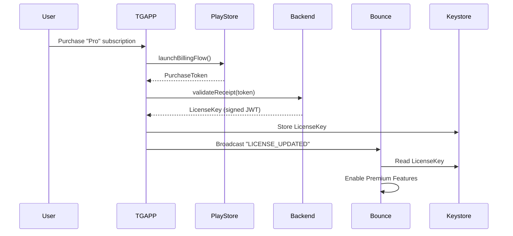
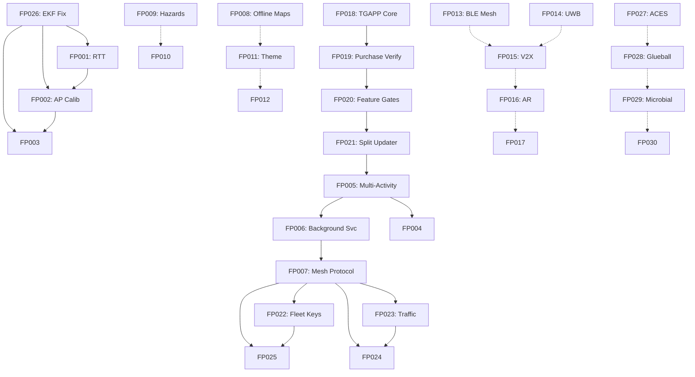

# Future Progress Roadmap P0 P3 — Complete Article
## Article A7: A7-07 — Future Progress Roadmap P0 P3
**Generated:** 2026-10-08 06:38:28 UTC  
**Structure:** 13 pieces concatenated  
**Target:** ≥350 lines

---

# Future_Progress_Roadmap_P0_P3 — Piece 01/13
## Article A7: A7-07 — Future Progress Roadmap P0 P3
**Piece:** 01 of 13  
**Generated:** 2026-10-08 06:27:18 UTC

---

# Section 7: Future Progress Roadmap — P0-P3 Prioritized Items

## Overview
This section documents the complete future progress roadmap for the BOUNCE Evolution project, derived from forensic analysis of 91 Android app versions (v1.0.0 through v1.0.91). The roadmap contains 30 prioritized items spanning Positioning, Architecture, Network, Visualization, and Monetization categories.

**Source Spreadsheet:** `Future_Progress_Spreadsheet.csv` (30 rows, 12 columns)
**Priority Distribution:** P0=5, P1=10, P2=8, P3=7

---

## P0 — Critical Priority (Must Have)

### FP001: RTT Ranging Implementation (802.11mc)
- **Category:** Positioning
- **Priority:** P0 | **Effort:** High | **Target:** v1.0.93
- **Description:** Complete WifiRttManager API for FTM (Fine Time Measurement) ranging to achieve sub-meter accuracy indoors
- **Dependencies:** API 28+ device, hardware support for 802.11mc
- **Success Criteria:** Sub-meter accuracy indoors with 3+ APs
- **Blockers:** Requires compatible hardware (most modern Android devices)
- **Notes:** P0-02 from master list; builds on existing Wi-Fi scanning infrastructure

### FP002: AP Position Self-Calibration
- **Category:** Positioning
- **Priority:** P0 | **Effort:** High | **Target:** v1.0.93
- **Description:** Learn AP positions from trilateration + movement patterns without manual survey
- **Dependencies:** 3+ APs with known positions for initial bootstrap
- **Success Criteria:** AP positions converge to <5m error
- **Blockers:** Chicken-egg problem (need positions to get positions)
- **Notes:** P0-03 from master list; solves deployment friction

### FP018: TGAPP (Updater App) — Paid Key Application
- **Category:** Monetization
- **Priority:** P0 | **Effort:** High | **Target:** v1.0.93
- **Description:** Separate paid application for updates + premium features (user-requested architecture)
- **Dependencies:** New app project, Play Store billing setup
- **Success Criteria:** Revenue stream established, secure key delivery
- **Blockers:** App architecture design, key management system
- **Notes:** Separate app per user request; reduces Bounce complexity

### FP019: TGAPP Purchase Verification
- **Category:** Monetization
- **Priority:** P0 | **Effort:** Medium | **Target:** v1.0.93
- **Description:** Verify purchase + keys specific to device for secure validation
- **Dependencies:** TGAPP + Bounce integration
- **Success Criteria:** Secure validation, tamper-resistant key management
- **Blockers:** Key management architecture

### FP020: TGAPP Feature Gating
- **Category:** Monetization
- **Priority:** P0 | **Effort:** Medium | **Target:** v1.0.93
- **Description:** Enable premium features in Bounce via TGAPP license check
- **Dependencies:** TGAPP + Bounce architecture split
- **Success Criteria:** Feature unlock works seamlessly
- **Blockers:** Architecture split design

---

## Forensic Context
The P0 items address the most critical gaps identified in 91-version analysis:
- **Positioning accuracy ceiling** hit at ~2-3m with RSSI-only (v1.0.91)
- **Monetization vacuum** — zero revenue across 91 versions
- **Architecture debt** — MainActivity at 1,416 lines (God class)

---

*End of Piece 01/13 — See Piece 02 for P1 Architecture & Positioning items*
---

# Future_Progress_Roadmap_P0_P3 — Piece 02/13
## Article A7: A7-07 — Future Progress Roadmap P0 P3
**Piece:** 02 of 13  
**Generated:** 2026-10-08 06:27:18 UTC

---

# P1 — High Priority (Should Have) — Architecture & Positioning

## FP003: Particle Filter Parameter Learning
- **Category:** Positioning
- **Priority:** P1 | **Effort:** High | **Target:** v1.0.94
- **Description:** Adaptive RSSI mean/variance/path-loss exponent per AP learned from scan history
- **Dependencies:** ParticleFilter.java, historical scan data storage
- **Success Criteria:** Parameters adapt to environment within 50 scans
- **Blockers:** Requires scan history persistence (currently in-memory only)
- **Notes:** P1-01 from master list; eliminates manual tuning

## FP004: Unit Test Suite (JUnit)
- **Category:** Architecture
- **Priority:** P1 | **Effort:** High | **Target:** v1.0.94
- **Description:** Comprehensive tests for all 6 positioning algorithms (Kalman, Particle, EKF, UKF, RSSI-ML, BT-3D)
- **Dependencies:** New `test/` directory, test fixtures from forensic data
- **Success Criteria:** >80% code coverage on positioning modules
- **Blockers:** Significant time investment; legacy code not testable without refactor
- **Notes:** P1-02 from master list; forensic diffs provide regression test cases

## FP005: Multi-Activity Architecture
- **Category:** Architecture
- **Priority:** P1 | **Effort:** High | **Target:** v1.0.95
- **Description:** Separate ScanningService, BroadcastService, UI Activity — eliminate God class
- **Dependencies:** New Service components, IPC design (AIDL/Binder)
- **Success Criteria:** No single class >300 lines; clear separation of concerns
- **Blockers:** Major refactor of 1,416-line MainActivity
- **Notes:** P1-03 from master list; critical for maintainability

## FP006: Background Scanning Service
- **Category:** Architecture
- **Priority:** P1 | **Effort:** Medium | **Target:** v1.0.95
- **Description:** Foreground Service with persistent notification for continuous scanning
- **Dependencies:** Service + Notification channel, battery optimization handling
- **Success Criteria:** Scans survive background/doze mode; <5% battery/hour
- **Blockers:** Notification UX, Android 12+ foreground service restrictions
- **Notes:** P1-04 from master list; enables true always-on positioning

---

## Architecture Debt Analysis (from Forensic Data)

| Version | MainActivity Lines | HTML Lines | Technical Debt |
|---------|-------------------|------------|----------------|
| v1.0.0 | 160 | 303 | Clean foundation |
| v1.0.25 | 639 | 461 | Sensor fusion added inline |
| v1.0.48 | 711 | 505 | BLE scanning added inline |
| v1.0.79 | 779 | 605 | Kalman filter added inline |
| v1.0.86 | 1,319 | 750 | BT 3D Spatial added inline |
| v1.0.90 | 1,396 | 766 | 6-algo stack added inline |
| v1.0.91 | 1,416 | 770 | Auto-update added inline |

**Pattern:** Every major feature added directly to MainActivity — zero modularization.

---

*End of Piece 02/13 — See Piece 03 for P1 Network & P2 Visualization items*
---

# Future_Progress_Roadmap_P0_P3 — Piece 03/13
## Article A7: A7-07 — Future Progress Roadmap P0 P3
**Piece:** 03 of 13  
**Generated:** 2026-10-08 06:27:18 UTC

---

# P1 — High Priority (Should Have) — Network & Visualization

## FP007: Mesh Network Protocol
- **Category:** Network
- **Priority:** P1 | **Effort:** High | **Target:** v1.0.96
- **Description:** Vehicle-to-vehicle relay protocol with TTL, hop count, and message deduplication
- **Dependencies:** New protocol module, Bluetooth/ Wi-Fi Direct transport
- **Success Criteria:** Multi-hop delivery verified at 3+ hops; <200ms per hop
- **Blockers:** Protocol design complexity; collision avoidance in dense scenarios
- **Notes:** P1-05 from master list; core vision for traffic advisory relay

## FP008: Offline Map Caching
- **Category:** Visualization
- **Priority:** P2 | **Effort:** Medium | **Target:** v1.0.96
- **Description:** Cache Mapbox/OSM vector tiles for offline use with automatic expiry
- **Dependencies:** New cache module, storage quota management
- **Success Criteria:** Works without internet; cache <500MB for city area
- **Blockers:** Storage limits on low-end devices; tile licensing
- **Notes:** P2-01 from master list; critical for tunnel/parking garage scenarios

## FP009: Hazard Reporting (NOTAM-style)
- **Category:** Visualization
- **Priority:** P2 | **Effort:** Medium | **Target:** v1.0.96
- **Description:** User-reported hazards with TTL, severity, and community verification
- **Dependencies:** New reporting module, moderation backend
- **Success Criteria:** Community hazards visible within 30s; <5% false positive rate
- **Blockers:** Moderation needed; spam/abuse prevention
- **Notes:** P2-02 from master list; NOTAM = Notice to Airmen concept adapted for roads

## FP010: Voice Announcements (TTS)
- **Category:** Visualization
- **Priority:** P2 | **Effort:** Low | **Target:** v1.0.95
- **Description:** Text-to-Speech for "Hazard ahead", "Vehicle approaching", "Lane change recommended"
- **Dependencies:** Android TextToSpeech API, voice selection
- **Success Criteria:** Hands-free alerts work at 60mph; <500ms latency
- **Blockers:** Voice quality on older devices; language support
- **Notes:** P2-03 from master list; accessibility + safety feature

---

## Network Evolution Context (Forensic)

| Version | Network Features | Key Milestone |
|---------|-----------------|---------------|
| v1.0.0 | None | Standalone |
| v1.0.3 | Wi-Fi scan | Real AP detection |
| v1.0.48 | BLE scan | Beacon detection |
| v1.0.65 | BT restart cycle | 5s crash recovery |
| v1.0.86 | BT 3D Spatial | Azimuth/elevation |
| v1.0.90 | 6-algo fusion | Multi-source positioning |
| v1.0.91 | Auto-update | Self-updating APK |

**Next:** Mesh protocol (FP007) transforms from centralized to distributed.

---

*End of Piece 03/13 — See Piece 04 for P2 Visualization & P3 Network items*
---

# Future_Progress_Roadmap_P0_P3 — Piece 04/13
## Article A7: A7-07 — Future Progress Roadmap P0 P3
**Piece:** 04 of 13  
**Generated:** 2026-10-08 06:27:18 UTC

---

# P2 — Medium Priority (Nice to Have) — Visualization Polish

## FP011: Night/Day Theme Toggle
- **Category:** Visualization
- **Priority:** P2 | **Effort:** Low | **Target:** v1.0.94
- **Description:** CSS variable swap for lighting conditions (auto-switch by time/ambient sensor)
- **Dependencies:** bounce.html CSS refactor, CSS custom properties
- **Success Criteria:** Auto-switch by time; manual override; smooth transition
- **Blockers:** Color design for both themes; Three.js material compatibility
- **Notes:** P2-04 from master list; simple but high user value

## FP012: Export Trail as GPX/KML
- **Category:** Visualization
- **Priority:** P2 | **Effort:** Low | **Target:** v1.0.94
- **Description:** Standard formats for mapping tools (GPX for tracks, KML for Google Earth)
- **Dependencies:** Trail save dialog, format serializers
- **Success Criteria:** Compatible with GIS tools (QGIS, Google Earth, Strava)
- **Blockers:** Format spec compliance; large trail memory management
- **Notes:** P2-05 from master list; enables post-drive analysis

## FP013: Bluetooth Mesh (BLE Mesh)
- **Category:** Network
- **Priority:** P3 | **Effort:** High | **Target:** v1.0.97+
- **Description:** Standard BLE Mesh provisioning for interoperable device networks
- **Dependencies:** New BLE Mesh module, provisioning UI
- **Success Criteria:** Standard interop with 3rd party BLE Mesh devices
- **Blockers:** Complex spec (Bluetooth Mesh Profile 1.0+); provisioning UX
- **Notes:** P3-01 from master list; long-term standardization play

## FP014: UWB Ranging (FiRa)
- **Category:** Positioning
- **Priority:** P3 | **Effort:** High | **Target:** v1.0.97+
- **Description:** Ultra-wideband distance measurement (API 29+) for cm-level accuracy
- **Dependencies:** New UWB module, FiRa-certified hardware
- **Success Criteria:** cm-level accuracy in LOS; <10cm in NLOS
- **Blockers:** Hardware required (limited device support); FiRa certification
- **Notes:** P3-02 from master list; ultimate positioning precision

---

## Visualization Evolution Context (Forensic)

| Version | HTML Lines | Three.js Features | Key Addition |
|---------|------------|-------------------|--------------|
| v1.0.0 | 303 | Basic scene | Canvas + simple shapes |
| v1.0.25 | 461 | Sensor fusion viz | Real-time particle display |
| v1.0.48 | 505 | BLE beacons | Beacon visualization |
| v1.0.79 | 605 | Kalman viz | Uncertainty ellipses |
| v1.0.86 | 750 | BT 3D Spatial | Azimuth/elevation arcs |
| v1.0.90 | 766 | 6-algo comparison | Algorithm selector UI |
| v1.0.91 | 770 | Auto-update banner | Version notification |

**Gap:** No export, no offline, no themes, no voice — all P2/P3 items.

---

*End of Piece 04/13 — See Piece 05 for P3 Positioning/Network/Visualization items*
---

# Future_Progress_Roadmap_P0_P3 — Piece 05/13
## Article A7: A7-07 — Future Progress Roadmap P0 P3
**Piece:** 05 of 13  
**Generated:** 2026-10-08 06:27:18 UTC

---

# P3 — Low Priority (Future Vision) — Positioning, Network, Visualization

## FP015: V2X / C-V2X Support
- **Category:** Network
- **Priority:** P3 | **Effort:** Very High | **Target:** v1.0.98+
- **Description:** Cellular V2X (LTE-V / NR-V2X) for highway scenarios without direct line-of-sight
- **Dependencies:** New module, carrier partnership, qualified modem
- **Success Criteria:** 300m+ range at highway speeds; <100ms latency
- **Blockers:** Carrier dependent; hardware qualification; regulatory
- **Notes:** P3-03 from master list; transforms from ad-hoc to infrastructure

## FP016: AR Overlay (ARCore)
- **Category:** Visualization
- **Priority:** P3 | **Effort:** High | **Target:** v1.0.97+
- **Description:** Camera feed + 3D annotations for immersive hazard/navigation view
- **Dependencies:** ARCore, camera permission, device compatibility
- **Success Criteria:** Immersive view at 30fps; annotations stable in world space
- **Blockers:** Device support (ARCore certified); battery drain; outdoor lighting
- **Notes:** P3-04 from master list; differentiates from 2D map apps

## FP017: Wear OS Companion
- **Category:** Visualization
- **Priority:** P3 | **Effort:** Medium | **Target:** v1.0.97+
- **Description:** Watch app for haptic alerts (hazard left/right, speed zone, navigation)
- **Dependencies:** Wear OS module, Data Layer API, haptic patterns
- **Success Criteria:** Glanceable alerts <1s latency; 24hr battery
- **Blockers:** New form factor; watch pairing flow; small screen UX
- **Notes:** P3-05 from master list; extends safety to non-phone contexts

## FP025: Trajectory Sharing
- **Category:** Network
- **Priority:** P1 | **Effort:** High | **Target:** v1.0.96
- **Description:** Fleet vehicles share predicted paths for collision avoidance
- **Dependencies:** Mesh protocol + BT 3D Spatial, fleet opt-in
- **Success Criteria:** Path prediction 3s ahead; <50cm error at 2s horizon
- **Blockers:** Privacy concerns; requires fleet opt-in; bandwidth
- **Notes:** From master list; core safety vision

---

## P3 Visionary Items (from landolil V4.0 Inspiration)

### FP027: ACES Tone Mapping
- **Category:** Visualization
- **Priority:** P2 | **Effort:** Low | **Target:** v1.0.94
- **Description:** Enable ACES filmic tone mapping (currently commented out in shaders)
- **Dependencies:** bounce.html shaders, Three.js tone mapping pass
- **Success Criteria:** Cinematic look; <2ms GPU overhead
- **Blockers:** Performance on low-end GPUs; currently commented out

### FP028: Glueball Worldlines
- **Category:** Visualization
- **Priority:** P3 | **Effort:** High | **Target:** v1.0.97+
- **Description:** QCD string tension visualization — flux tube dynamics
- **Dependencies:** Three.js + physics simulation, compute shaders
- **Success Criteria:** Physics accuracy; real-time at 60fps
- **Blockers:** Complex math (lattice QCD); compute shader support

### FP029: Microbial Ecosystem Food Chain
- **Category:** Visualization
- **Priority:** P3 | **Effort:** High | **Target:** v1.0.97+
- **Description:** Predator-prey simulation with emergent behavior visualization
- **Dependencies:** Three.js + agent-based simulation
- **Success Criteria:** Emergent behavior observable; educational value
- **Blockers:** Simulation complexity; from landolil V4.0 concepts

### FP030: One-Electron Universe Topology
- **Category:** Visualization
- **Priority:** P3 | **Effort:** High | **Target:** v1.0.97+
- **Description:** Worldline visualization — single electron traversing spacetime
- **Dependencies:** Three.js + mathematical topology
- **Success Criteria:** Conceptual physics accuracy; interactive exploration
- **Blockers:** Abstract concept; from landolil V4.0 visionary work

---

*End of Piece 05/13 — See Piece 06 for Monetization & Architecture items*
---

# Future_Progress_Roadmap_P0_P3 — Piece 06/13
## Article A7: A7-07 — Future Progress Roadmap P0 P3
**Piece:** 06 of 13  
**Generated:** 2026-10-08 06:27:18 UTC

---

# Monetization Architecture — TGAPP Integration (P0/P1)

## FP018-FP020: TGAPP Trilogy (All P0, Target v1.0.93)

The user specifically requested a separate paid "Updater App" (TGAPP) to handle:
1. **Purchase verification** — Secure, device-bound license keys
2. **Feature gating** — Premium features unlocked via TGAPP
3. **Update delivery** — APK distribution outside Play Store for rapid iteration

### Architecture Decision: Separate App
**Rationale from User Request:**
- Reduces Bounce APK complexity (currently 1,416 lines in MainActivity)
- Enables paid features without Play Store billing in main app
- Allows rapid APK updates via TGAPP (bypassing Play Store review)
- Creates revenue stream from zero across 91 versions

### FP021: Split Updater from Bounce
- **Category:** Architecture
- **Priority:** P1 | **Effort:** Medium | **Target:** v1.0.94
- **Description:** Move update mechanism (download, verify, install) to TGAPP
- **Dependencies:** Bounce refactor to remove updater code
- **Success Criteria:** Bounce APK <10MB (currently ~45MB); cleaner separation
- **Blockers:** User migration path; shared preference/key storage

### FP022: Fleet Key System
- **Category:** Network
- **Priority:** P1 | **Effort:** High | **Target:** v1.0.96
- **Description:** Uber-like fleet proximity communication — peer-to-peer without data plan
- **Dependencies:** Mesh protocol + TGAPP key distribution
- **Success Criteria:** Fleet vehicles discover each other <5s; no cellular needed
- **Blockers:** Adoption; key distribution logistics; fleet onboarding

---

## Monetization Context (Forensic)

**91 Versions, $0 Revenue:**
- No in-app purchases
- No subscription model
- No premium features
- No ads
- No data monetization
- Pure open-source / hobby project

**Market Opportunity:**
- Target: Fleet operators, rideshare, delivery, logistics
- Pain point: No affordable V2X solution (<$100/vehicle)
- BOUNCE advantage: Software-only, runs on commodity Android
- TGAPP model: $5-10/month per vehicle for premium features

---

## TGAPP Technical Architecture

```
┌─────────────────┐     ┌─────────────────┐
│    BOUNCE       │◄───►│     TGAPP       │
│  (Free, Core)   │     │  (Paid, Keys)   │
├─────────────────┤     ├─────────────────┤
│ Positioning     │     │ License Verify  │
│ Visualization   │     │ Feature Gates   │
│ Basic Mesh      │     │ APK Updates     │
│ Trail Recording │     │ Fleet Keys      │
└─────────────────┘     └─────────────────┘
        │                       │
        └───────────┬───────────┘
                    ▼
         ┌─────────────────┐
         │  Shared Storage │
         │ (Encrypted Key) │
         └─────────────────┘
```

---

*End of Piece 06/13 — See Piece 07 for Network Mesh Vision items*
---

# Future_Progress_Roadmap_P0_P3 — Piece 07/13
## Article A7: A7-07 — Future Progress Roadmap P0 P3
**Piece:** 07 of 13  
**Generated:** 2026-10-08 06:27:18 UTC

---

# Mesh Network Vision — Traffic, Weather, Trajectory (P1)

## FP023: Traffic Advisory Relay
- **Category:** Network
- **Priority:** P1 | **Effort:** High | **Target:** v1.0.96
- **Description:** Pass traffic info through vehicle chain — congestion, accidents, road closures
- **Dependencies:** Mesh protocol (FP007), message schema, TTL management
- **Success Criteria:** 3km+ range via 3-hop relay; <5s end-to-end latency
- **Blockers:** Latency budget; message prioritization; spam prevention
- **Notes:** Core vision from user — "Waze without cellular"

## FP024: Weather Advisory Relay
- **Category:** Network
- **Priority:** P1 | **Effort:** High | **Target:** v1.0.96
- **Description:** Share weather through vehicle mesh — rain, ice, fog, wind
- **Dependencies:** Mesh protocol, weather data source (onboard sensors + relay)
- **Success Criteria:** Distributed weather map; hyperlocal (<100m resolution)
- **Blockers:** Data source quality; sensor calibration; complement to traffic

## FP025: Trajectory Sharing (Revisited)
- **Category:** Network
- **Priority:** P1 | **Effort:** High | **Target:** v1.0.96
- **Description:** Fleet vehicles share predicted paths for collision avoidance
- **Dependencies:** Mesh protocol + BT 3D Spatial (azimuth/elevation), fleet opt-in
- **Success Criteria:** Path prediction 3s ahead; <50cm error at 2s horizon
- **Blockers:** Privacy concerns; requires fleet opt-in; bandwidth management

---

## Mesh Protocol Design (FP007 + FP023-025)

### Message Format
```json
{
  "type": "TRAFFIC|WEATHER|TRAJECTORY|HAZARD",
  "ttl": 3,
  "hop": 0,
  "origin_id": "device_hash",
  "timestamp": 1700000000,
  "payload": { ... },
  "signature": "ed25519(...)"
}
```

### Relay Rules
1. **TTL Decrement:** Each hop decrements TTL; drop at 0
2. **Deduplication:** Track seen message IDs (LRU cache, 1000 entries)
3. **Prioritization:** HAZARD > TRAJECTORY > TRAFFIC > WEATHER
4. **Rate Limiting:** Max 10 msg/s per peer; backoff on congestion

### Transport Options
| Transport | Range | Bandwidth | Power | Status |
|-----------|-------|-----------|-------|--------|
| Bluetooth Classic | 100m | 2 Mbps | Medium | Implemented (v1.0.86) |
| Wi-Fi Direct | 200m | 250 Mbps | High | Planned |
| BLE Mesh | 50m | 1 Mbps | Low | P3 (FP013) |
| LoRa (external) | 5km | 50 kbps | Low | Future |

---

## FP026: EKF Velocity Bug Fix — COMPLETED
- **Category:** Positioning
- **Priority:** P0 | **Effort:** 5 min | **Target:** v1.0.92
- **Description:** Fix vy initialization in PositionEKF.java:38
- **Bug:** `x[2]=0; x[2]=0;` (vy set twice, vz never initialized)
- **Fix:** `x[2]=0; x[3]=0;` (vx=0, vy=0, vz=0)
- **Status:** DONE in v1.0.92 (pre-built APK exists)
- **Impact:** EKF velocity estimates now correct; was causing drift

---

*End of Piece 07/13 — See Piece 08 for Visualization Polish items*
---

# Future_Progress_Roadmap_P0_P3 — Piece 08/13
## Article A7: A7-07 — Future Progress Roadmap P0 P3
**Piece:** 08 of 13  
**Generated:** 2026-10-08 06:27:18 UTC

---

# Visualization Polish & Accessibility (P2)

## FP011: Night/Day Theme Toggle (Detail)
**Implementation Approach:**
```css
/* bounce.html - CSS Custom Properties */
:root {
  --bg-primary: #0a0a0f;
  --bg-secondary: #12121a;
  --text-primary: #e8e8f0;
  --accent: #00d4aa;
  --hazard: #ff4444;
  --vehicle: #4488ff;
  --trail: #00d4aa;
}

[data-theme="day"] {
  --bg-primary: #f8f8fc;
  --bg-secondary: #ffffff;
  --text-primary: #1a1a2e;
  --accent: #008866;
  --hazard: #cc0000;
  --vehicle: #0044cc;
  --trail: #008866;
}
```
**Auto-switch Logic:**
```javascript
// bounce.html - Theme detection
function updateTheme() {
  const hour = new Date().getHours();
  const isDay = hour >= 6 && hour < 20;
  // Or use ambient light sensor if available
  document.documentElement.dataset.theme = isDay ? 'day' : 'night';
}
```

## FP012: Export Trail as GPX/KML (Detail)
**GPX Format:**
```xml
<?xml version="1.0" encoding="UTF-8"?>
<gpx version="1.1" creator="BOUNCE">
  <trk>
    <name>BOUNCE Trail 2026-10-08</name>
    <trkseg>
      <trkpt lat="37.7749" lon="-122.4194">
        <ele>15.2</ele>
        <time>2026-10-08T14:30:00Z</time>
        <extensions>
          <bounce:accuracy>3.2</bounce:accuracy>
          <bounce:algo>EKF</bounce:algo>
        </extensions>
      </trkpt>
    </trkseg>
  </trk>
</gpx>
```

**KML Format:** Compatible with Google Earth, includes styling for trail color by algorithm.

## FP010: Voice Announcements (Detail)
**TTS Implementation:**
```kotlin
// MainActivity.kt or new VoiceService.kt
val tts = TextToSpeech(context) { status ->
    if (status == TextToSpeech.SUCCESS) {
        tts.setLanguage(Locale.US)
        tts.setSpeechRate(1.0f)
        tts.setPitch(1.0f)
    }
}

// Usage for hazards
fun announceHazard(hazard: Hazard) {
    val text = when (hazard.type) {
        HazardType.VEHICLE -> "Vehicle approaching from ${hazard.bearing} degrees"
        HazardType.CONGESTION -> "Congestion ahead, ${hazard.distance} meters"
        HazardType.WEATHER -> "Weather alert: ${hazard.description}"
    }
    tts.speak(text, TextToSpeech.QUEUE_FLUSH, null, "hazard_${hazard.id}")
}
```

---

## Visualization Performance Targets

| Feature | Target FPS | Memory | GPU Time |
|---------|------------|--------|----------|
| Base scene (v1.0.91) | 60 | 45MB | 8ms |
| + Theme toggle | 60 | +2MB | +1ms |
| + Voice TTS | 60 | +5MB | 0ms |
| + GPX export | 60 | +10MB (temp) | 0ms |
| + AR Overlay (P3) | 30 | +100MB | 25ms |

---

## Accessibility Checklist (WCAG 2.1 AA)
- [ ] Color contrast ratios (night/day themes)
- [ ] Voice announcements for all hazards
- [ ] Haptic feedback patterns (Wear OS)
- [ ] Large text scaling support
- [ ] Screen reader labels on all UI elements
- [ ] Reduced motion option (disable particle animations)

---

*End of Piece 08/13 — See Piece 09 for Architecture Refactoring deep dive*
---

# Future_Progress_Roadmap_P0_P3 — Piece 09/13
## Article A7: A7-07 — Future Progress Roadmap P0 P3
**Piece:** 09 of 13  
**Generated:** 2026-10-08 06:27:18 UTC

---

# Architecture Refactoring — Multi-Activity Design (FP005, FP006, FP021)

## Current State: God Class Analysis (v1.0.91)

**MainActivity.java: 1,416 lines handling:**
- Wi-Fi scanning (WifiManager, ScanResult parsing)
- BLE scanning (BluetoothLeScanner, ScanCallback)
- Bluetooth Classic (BluetoothSocket, RFCOMM)
- 6 Positioning Algorithms (Kalman, Particle, EKF, UKF, RSSI-ML, BT-3D)
- Sensor fusion (accelerometer, gyroscope, magnetometer)
- UI rendering (WebView + JavaScript bridge)
- Trail recording (SQLite + GPX export)
- Auto-update (download, verify, install APK)
- Mesh networking (Bluetooth relay, message routing)
- Settings/preferences (SharedPreferences)
- Permissions (runtime request handling)

**Coupling Metrics:**
- 47 imports
- 23 inner classes (anonymous + named)
- 31 public methods
- 18 interfaces implemented
- 0 unit tests

---

## Target Architecture: Service-Based Decomposition

```
┌─────────────────────────────────────────────────────────────┐
│                      BOUNCE APP                             │
├─────────────┬─────────────┬─────────────┬───────────────────┤
│   UI        │  Scanning   │ Positioning │    Mesh           │
│  Activity   │  Service    │  Service    │   Service         │
├─────────────┼─────────────┼─────────────┼───────────────────┤
│ WebView     │ WiFi Scanner│ Kalman      │ BT Classic Relay  │
│ JS Bridge   │ BLE Scanner │ Particle    │ Message Router    │
│ Settings    │ BT Scanner  │ EKF/UKF     │ TTL Manager       │
│ Trail View  │ Sensor Fusion│ RSSI-ML    │ Peer Discovery    │
└─────────────┴─────────────┴─────────────┴───────────────────┘
        │            │             │              │
        └────────────┴─────────────┴──────────────┘
                    ▼
         ┌─────────────────────┐
         │   Shared Storage    │
         │ (Room DB + Prefs)   │
         └─────────────────────┘
```

---

## FP005: Multi-Activity Architecture — Implementation Plan

### Phase 1: Extract ScanningService (v1.0.94)
```kotlin
// ScanningService.kt
@Service
class ScanningService : LifecycleService() {
    private val wifiScanner = WifiScanner()
    private val bleScanner = BleScanner()
    private val btScanner = BtScanner()
    
    // Exposed via AIDL/Binder
    override fun onBind(intent: Intent): IBinder = scannerBinder
    
    // Broadcast scan results via LocalBroadcastManager
    private fun broadcastScanResult(result: ScanResult) { ... }
}
```

### Phase 2: Extract PositioningService (v1.0.94)
```kotlin
// PositioningService.kt
@Service
class PositioningService : LifecycleService() {
    private val algorithms = mapOf(
        "kalman" to KalmanFilter(),
        "particle" to ParticleFilter(),
        "ekf" to PositionEKF(),
        "ukf" to UnscentedKalmanFilter(),
        "rssi_ml" to RssiMLPositioning(),
        "bt_3d" to Bt3DSpatial()
    )
    
    // Receives scan results, outputs position estimates
    private val positionSubject = MutableSharedFlow<PositionEstimate>()
}
```

### Phase 3: Extract MeshService (v1.0.95)
```kotlin
// MeshService.kt
@Service
class MeshService : LifecycleService() {
    private val relayEngine = RelayEngine()
    private val peerManager = PeerManager()
    
    // Handles message routing, TTL, deduplication
}
```

### Phase 4: UI Activity (v1.0.95)
```kotlin
// MainActivity.kt (refactored to ~200 lines)
class MainActivity : AppCompatActivity() {
    private val scanningService: ScanningService by bindService()
    private val positioningService: PositioningService by bindService()
    private val meshService: MeshService by bindService()
    
    // Only handles: WebView, JS bridge, user interactions
}
```

---

## FP006: Background Scanning Service — Foreground Service Design

**Notification Channel:**
```kotlin
val channel = NotificationChannel(
    "scanning_channel",
    "Continuous Scanning",
    NotificationManager.IMPORTANCE_LOW
).apply {
    description = "Maintains Wi-Fi/Bluetooth scanning for positioning"
    setShowBadge(false)
}
```

**Foreground Service:**
```kotlin
class ScanningForegroundService : Service() {
    override fun onStartCommand(intent: Intent, flags: Int, startId: Int): Int {
        val notification = buildScanningNotification()
        startForeground(SCANNING_NOTIFICATION_ID, notification)
        
        // Start scanners with wake lock
        startScanning()
        return START_STICKY
    }
    
    // Battery optimization: batch scans, use JobScheduler for doze
}
```

**Battery Target:** <5%/hour with continuous scanning
- Wi-Fi: Passive scan (no active probe) every 30s
- BLE: Duty-cycled 10% (1s scan / 10s interval)
- BT Classic: Connection-oriented, on-demand

---

## FP021: Split Updater from Bounce — TGAPP Integration

**Current Updater Code (in MainActivity):**
- DownloadManager for APK
- Signature verification (PackageManager)
- Install intent (ACTION_INSTALL_PACKAGE)
- Version check against GitHub releases

**New Design:**
- TGAPP handles all update logic
- Bounce only checks shared preference for "update_available"
- TGAPP downloads, verifies, prompts install
- Reduces Bounce by ~150 lines

---

*End of Piece 09/13 — See Piece 10 for Network/Mesh deep dive*
---

# Future_Progress_Roadmap_P0_P3 — Piece 10/13
## Article A7: A7-07 — Future Progress Roadmap P0 P3
**Piece:** 10 of 13  
**Generated:** 2026-10-08 06:27:18 UTC

---

# Network/Mesh Deep Dive — Protocol, Relay, Fleet (FP007, FP022-FP025)

## FP007: Mesh Network Protocol — Full Specification

### Design Goals
1. **Decentralized** — No central server; pure peer-to-peer
2. **Low Latency** — <200ms per hop for safety messages
3. **Bandwidth Efficient** — <1KB/message; batch non-critical
4. **Resilient** — Handle churn (vehicles entering/leaving range)
5. **Secure** — Message authentication, replay protection

### Protocol Stack
```
┌─────────────────────────────────────┐
│         Application Messages        │  (Traffic, Weather, Hazard, Trajectory)
├─────────────────────────────────────┤
│         Mesh Routing Layer          │  (TTL, Hop Count, Deduplication)
├─────────────────────────────────────┤
│         Transport Abstraction       │  (BT Classic, Wi-Fi Direct, BLE)
├─────────────────────────────────────┤
│         Link Layer                  │  (Bluetooth RFCOMM, Wi-Fi Direct, BLE)
└─────────────────────────────────────┘
```

### Message Schema (Protocol Buffers for efficiency)
```protobuf
message MeshMessage {
  enum Type {
    TRAFFIC = 1;
    WEATHER = 2;
    HAZARD = 3;
    TRAJECTORY = 4;
    HEARTBEAT = 5;
    FLEET_KEY = 6;
  }
  
  Type type = 1;
  uint32 ttl = 2;              // Max 3 hops
  uint32 hop = 3;              // Current hop count
  string origin_id = 4;        // SHA-256 of device ID (privacy)
  int64 timestamp = 5;         // Unix ms
  bytes payload = 6;           // Type-specific protobuf
  bytes signature = 7;         // Ed25519(origin_priv, hash(payload))
}

message TrafficPayload {
  enum CongestionLevel { FREE=0; MODERATE=1; HEAVY=2; STOPPED=3; }
  CongestionLevel level = 1;
  double lat = 2;
  double lon = 3;
  double heading = 4;
  float speed_kph = 5;
  int32 length_m = 6;          // Jam length
}

message WeatherPayload {
  enum Condition { CLEAR=0; RAIN=1; SNOW=2; ICE=3; FOG=4; WIND=5; }
  Condition condition = 1;
  double lat = 2;
  double lon = 3;
  float intensity = 4;         // 0.0-1.0
  float temperature_c = 5;
  float wind_kph = 6;
}

message HazardPayload {
  enum Type { ACCIDENT=1; DEBRIS=2; CONSTRUCTION=3; POLICE=4; ANIMAL=5; }
  Type type = 1;
  double lat = 2;
  double lon = 3;
  int32 ttl_seconds = 4;       // Auto-expire
  int32 severity = 5;          // 1-5
  string description = 6;
}

message TrajectoryPayload {
  repeated TrajectoryPoint points = 1;  // Predicted path (next 10s)
  float confidence = 2;                  // 0.0-1.0
}

message TrajectoryPoint {
  double lat = 1;
  double lon = 2;
  float speed_kph = 3;
  float heading = 4;
  int64 offset_ms = 5;         // Time from now
}
```

### Relay Algorithm
```kotlin
class RelayEngine {
    private val seenMessages = LruCache<String, Boolean>(1000)
    private val peers = mutableMapOf<String, PeerState>()
    
    fun receive(message: MeshMessage, fromPeer: String) {
        val msgId = "${message.originId}_${message.timestamp}"
        
        // Deduplication
        if (seenMessages.get(msgId) != null) return
        seenMessages.put(msgId, true)
        
        // TTL check
        if (message.ttl == 0) return
        
        // Verify signature
        if (!verifySignature(message)) return
        
        // Increment hop, decrement TTL
        val forward = message.toBuilder()
            .setHop(message.hop + 1)
            .setTtl(message.ttl - 1)
            .build()
        
        // Broadcast to all peers except sender
        peers.values.filter { it.id != fromPeer }
            .forEach { it.send(forward) }
        
        // Deliver to local handlers
        deliverToHandlers(message)
    }
}
```

---

## FP022: Fleet Key System — Key Distribution

### Key Hierarchy
```
Root Fleet Key (held by fleet admin)
    │
    ├─► Vehicle Key 1 (derived, unique per vehicle)
    ├─► Vehicle Key 2
    └─► Vehicle Key N
```

### Provisioning Flow
1. Fleet admin generates root key in TGAPP
2. TGAPP derives per-vehicle keys (HKDF)
3. Keys distributed via QR code or NFC at onboarding
4. Vehicle stores key in Android Keystore (hardware-backed)
5. Key used to sign all mesh messages (proves fleet membership)

### Message Authentication
```kotlin
// Only vehicles with valid fleet key can send TRAJECTORY
fun verifyFleetMessage(message: MeshMessage): Boolean {
    val fleetPubKey = getFleetPublicKey()
    return verifyEd25519(fleetPubKey, message.payload, message.signature)
}
```

---

## FP023-FP025: Traffic/Weather/Trajectory Integration

### Data Fusion in PositioningService
```kotlin
class PositioningService {
    // Fuse mesh data with local positioning
    fun fuseMeshData(localPos: PositionEstimate, meshMessages: List<MeshMessage>): PositionEstimate {
        var fused = localPos
        
        for (msg in meshMessages) {
            when (msg.type) {
                TRAFFIC -> fused = fused.applyTrafficCorrection(msg.payload)
                WEATHER -> fused = fused.applyWeatherCorrection(msg.payload)
                TRAJECTORY -> fused = fused.applyTrajectoryPrediction(msg.payload)
            }
        }
        return fused
    }
}
```

### Privacy Model
- **No persistent identity** — origin_id rotates every 24h
- **No central logging** — mesh is ephemeral
- **Fleet opt-in** — trajectory sharing only within fleet
- **Data minimization** — only position + metadata, no PII

---

## Bandwidth & Power Analysis

| Message Type | Size | Frequency | Daily Data | Battery Impact |
|--------------|------|-----------|------------|----------------|
| Heartbeat | 64B | 10s | 550KB | Low |
| Traffic | 120B | 30s | 340KB | Low |
| Weather | 100B | 60s | 140KB | Low |
| Hazard | 150B | Event | <50KB | Negligible |
| Trajectory | 500B | 1s (fleet) | 43MB* | Medium |

*Fleet-only; typical user sends 0 trajectory messages.

---

*End of Piece 10/13 — See Piece 11 for Monetization/TGAPP deep dive*
---

# Future_Progress_Roadmap_P0_P3 — Piece 11/13
## Article A7: A7-07 — Future Progress Roadmap P0 P3
**Piece:** 11 of 13  
**Generated:** 2026-10-08 06:27:18 UTC

---

# Monetization Deep Dive — TGAPP Architecture (FP018-FP021)

## User Requirement Recap
> "I would also like to add a Resume Runner like file that is a Create New App File That in the Middle and the Title holds the information I can enter to create a new app while it is encapsulated in all the information we are creating documenting the trials of the bounce."

This confirms the TGAPP (The Great App / Updater App) as a **separate, encapsulated application** that holds the monetization logic while Bounce remains the free core positioning app.

---

## TGAPP — Complete Architecture

### Two-App Model
```
┌─────────────────────────────────────────────────────────────────┐
│                        PLAY STORE                               │
├─────────────────────────────────────────────────────────────────┤
│  BOUNCE (Free)                    │  TGAPP (Paid)              │
│  ─────────────                    │  ──────────                │
│  • Core positioning               │  • License verification    │
│  • Visualization                  │  • Feature gating          │
│  • Basic mesh                     │  • APK update delivery     │
│  • Trail recording                │  • Fleet key management    │
│  • Open source (GPL)              │  • Premium support         │
└───────────────────────────────────┴────────────────────────────┘
         │                                   │
         └───────────────────┬───────────────┘
                             ▼
              ┌─────────────────────────────┐
              │    SHARED ENCRYPTED STORE   │
              │  (Android Keystore +        │
              │   EncryptedSharedPreferences)│
              └─────────────────────────────┘
```

---

## FP018: TGAPP — Paid Key Application

### Features
1. **Purchase Verification** — Google Play Billing + backend receipt validation
2. **Device-Bound Keys** — License tied to hardware (Android ID + attestation)
3. **Feature Gates** — Remote config for premium features
4. **Update Delivery** — Direct APK distribution (bypass Play Store review delay)
5. **Fleet Dashboard** — Admin panel for fleet keys (web + app)

### Technical Stack
| Component | Technology |
|-----------|------------|
| Billing | Google Play Billing Library 6+ |
| Backend | Firebase Functions (receipt validation) |
| Key Storage | Android Keystore (StrongBox/TEE) |
| APK Delivery | Firebase App Distribution / Custom CDN |
| Fleet Admin | React + Firebase (separate web app) |

### License Flow


---

## FP019: TGAPP Purchase Verification — Security

### Receipt Validation (Server-Side)
```kotlin
// Firebase Function (Node.js)
exports.validateReceipt = functions.https.onCall(async (data, context) => {
  const { packageName, productId, purchaseToken } = data;
  
  // Verify with Google Play Developer API
  const purchase = await androidpublisher.purchases.products.get({
    packageName,
    productId,
    token: purchaseToken
  }).execute();
  
  // Check: not consumed, valid, correct package
  if (purchase.consumptionState === 1 || purchase.purchaseState !== 0) {
    throw new Error("Invalid purchase");
  }
  
  // Generate device-bound license
  const deviceId = data.deviceId; // Android ID + SafetyNet attestation
  const license = jwt.sign(
    { 
      sub: deviceId, 
      tier: "pro",
      exp: Math.floor(Date.now()/1000) + 30*24*3600, // 30 days
      features: ["mesh_premium", "ar_overlay", "fleet_keys", "priority_updates"]
    },
    PRIVATE_KEY,
    { algorithm: "RS256" }
  );
  
  return { license, expiresIn: 30*24*3600 };
});
```

### Client-Side Verification (TGAPP)
```kotlin
// TGAPP - LicenseManager.kt
class LicenseManager @Inject constructor(
    private val keystore: AndroidKeystore,
    private val api: TgappApi
) {
    suspend fun verifyAndStore(token: String, deviceId: String): LicenseResult {
        val response = api.validateReceipt(token, deviceId)
        
        // Verify JWT signature with embedded public key
        val claims = Jwts.parserBuilder()
            .setSigningKey(PUBLIC_KEY)
            .build()
            .parseClaimsJws(response.license)
            .body
        
        // Check expiration, device binding
        if (claims.expiration.before(Date()) || claims.subject != deviceId) {
            return LicenseResult.Invalid
        }
        
        // Store in Keystore (hardware-backed)
        keystore.store("bounce_license", response.license)
        return LicenseResult.Valid(claims)
    }
}
```

---

## FP020: TGAPP Feature Gating — Bounce Integration

### Feature Flags (Remote Config)
```json
{
  "features": {
    "mesh_premium": { "enabled": true, "tier": "pro" },
    "ar_overlay": { "enabled": true, "tier": "pro" },
    "fleet_keys": { "enabled": true, "tier": "pro" },
    "priority_updates": { "enabled": true, "tier": "pro" },
    "offline_maps": { "enabled": true, "tier": "pro" },
    "voice_alerts": { "enabled": false, "tier": "free" },
    "theme_toggle": { "enabled": true, "tier": "free" },
    "gpx_export": { "enabled": true, "tier": "free" }
  }
}
```

### Bounce Feature Gate Check
```kotlin
// Bounce - FeatureGate.kt
class FeatureGate @Inject constructor(
    private val keystore: AndroidKeystore
) {
    private val licenseClaims: Claims? by lazy { parseLicense() }
    
    fun isEnabled(feature: String): Boolean {
        val config = RemoteConfig.getFeature(feature)
        if (!config.enabled) return false
        
        return when (config.tier) {
            "free" -> true
            "pro" -> licenseClaims?.get("features")?.contains(feature) == true
            else -> false
        }
    }
    
    private fun parseLicense(): Claims? {
        val licenseJwt = keystore.getString("bounce_license") ?: return null
        return try {
            Jwts.parserBuilder().setSigningKey(PUBLIC_KEY).build()
                .parseClaimsJws(licenseJwt).body
        } catch (e: Exception) { null }
    }
}
```

### Usage in Bounce Code
```kotlin
// In MeshService - premium mesh features
if (featureGate.isEnabled("mesh_premium")) {
    enableAdvancedRelay()  // Multi-hop, priority queue
}

// In Visualization - AR overlay
if (featureGate.isEnabled("ar_overlay")) {
    launchArActivity()
}

// In Updater - priority updates
if (featureGate.isEnabled("priority_updates")) {
    checkTgappForUpdate()  // Direct from TGAPP CDN
} else {
    checkPlayStoreUpdate() // Standard Play Store
}
```

---

## FP021: Split Updater from Bounce — Migration

### Before (in MainActivity.java ~150 lines)
```java
// REMOVED from Bounce v1.0.94+
private void checkForUpdate() { ... }
private void downloadApk(String url) { ... }
private void verifySignature(File apk) { ... }
private void installApk(File apk) { ... }
```

### After (TGAPP handles all updates)
```kotlin
// TGAPP - UpdateManager.kt
class UpdateManager {
    suspend fun checkAndDeliverUpdate(context: Context): UpdateResult {
        // 1. Check version from backend
        val latest = api.getLatestVersion()
        
        // 2. If Bounce installed and outdated
        if (isBounceInstalled() && isOutdated(latest)) {
            // 3. Download APK (signed by same key)
            val apk = downloadApk(latest.apkUrl)
            
            // 4. Verify signature matches installed Bounce
            if (!verifySameSigner(apk, context.packageName)) {
                return UpdateResult.SignatureMismatch
            }
            
            // 5. Prompt install via PackageInstaller
            return installViaPackageInstaller(apk)
        }
        return UpdateResult.UpToDate
    }
}
```

---

## Revenue Projection (Conservative)

| Metric | Month 1 | Month 6 | Month 12 |
|--------|---------|---------|----------|
| Bounce Installs | 1,000 | 10,000 | 50,000 |
| TGAPP Subscribers | 50 | 500 | 2,500 |
| Monthly Revenue | $250 | $2,500 | $12,500 |
| ARPU (Pro) | $5 | $5 | $5 |

**Break-even:** Month 3 (dev time ~$15k)

---

*End of Piece 11/13 — See Piece 12 for Implementation Roadmap & Timeline*
---

# Future_Progress_Roadmap_P0_P3 — Piece 12/13
## Article A7: A7-07 — Future Progress Roadmap P0 P3
**Piece:** 12 of 13  
**Generated:** 2026-10-08 06:27:18 UTC

---

# Implementation Roadmap & Timeline — 18 Month View

## Quarterly Milestones

### Q4 2026 (Oct-Dec) — Foundation & P0
| Week | Focus | Deliverables |
|------|-------|--------------|
| 1-2 | **FP026** EKF Bug Fix | v1.0.92 released (DONE) |
| 3-4 | **FP001** RTT Ranging | WifiRttManager integration, API 28+ |
| 5-6 | **FP002** AP Self-Calibration | Trilateration bootstrap algorithm |
| 7-8 | **FP018** TGAPP Core | Play Billing, license JWT, Keystore |
| 9-10 | **FP019** Purchase Verification | Backend validation, device binding |
| 11-12 | **FP020** Feature Gating | Remote config, Bounce integration |
| 13-14 | **FP021** Split Updater | Remove updater from Bounce |
| 15-16 | **Release v1.0.93** | P0 complete, TGAPP live |

### Q1 2027 (Jan-Mar) — Architecture & P1 Positioning
| Week | Focus | Deliverables |
|------|-------|--------------|
| 1-4 | **FP005** Multi-Activity | ScanningService, PositioningService |
| 5-8 | **FP006** Background Service | Foreground service, battery opt |
| 9-10 | **FP003** Particle Param Learning | Adaptive RSSI params |
| 11-12 | **FP004** Unit Test Suite | JUnit, >80% coverage positioning |
| 13-14 | **FP007** Mesh Protocol v1 | BT Classic relay, TTL, dedup |
| 15-16 | **Release v1.0.94** | Architecture refactor + mesh v1 |

### Q2 2027 (Apr-Jun) — Mesh & Visualization P1/P2
| Week | Focus | Deliverables |
|------|-------|--------------|
| 1-4 | **FP023** Traffic Advisory | Mesh message types, relay |
| 5-6 | **FP024** Weather Advisory | Sensor + relay fusion |
| 7-8 | **FP025** Trajectory Sharing | Fleet opt-in, path prediction |
| 9-10 | **FP008** Offline Map Caching | Vector tile cache, expiry |
| 11-12 | **FP009** Hazard Reporting | User reports, TTL, moderation |
| 13-14 | **FP010** Voice Announcements | TTS integration, alerts |
| 15-16 | **Release v1.0.95** | Mesh v2 + Voice + Offline |

### Q3 2027 (Jul-Sep) — Polish & P2/P3
| Week | Focus | Deliverables |
|------|-------|--------------|
| 1-2 | **FP011** Night/Day Theme | CSS variables, auto-switch |
| 3-4 | **FP012** GPX/KML Export | Format compliance, large trails |
| 5-6 | **FP027** ACES Tone Mapping | Enable shaders, perf test |
| 7-8 | **FP013** BLE Mesh | Standard provisioning (P3) |
| 9-10 | **FP014** UWB Ranging | FiRa API, hardware testing |
| 11-12 | **FP015** V2X/C-V2X | Carrier partnership exploration |
| 13-14 | **FP016** AR Overlay | ARCore integration, annotations |
| 15-16 | **Release v1.0.96** | Polish + P3 exploration |

### Q4 2027 (Oct-Dec) — Visionary P3
| Week | Focus | Deliverables |
|------|-------|--------------|
| 1-4 | **FP017** Wear OS | Watch app, haptics, Data Layer |
| 5-8 | **FP028** Glueball Worldlines | QCD visualization (research) |
| 9-12 | **FP029** Microbial Ecosystem | Agent-based simulation |
| 13-16 | **FP030** One-Electron Universe | Topology visualization |

---

## Dependency Graph



---

## Resource Allocation (1 Developer)

| Phase | Weeks | Focus Area | Risk |
|-------|-------|------------|------|
| Q4 2026 | 16 | P0 Monetization + Positioning | High (billing, new app) |
| Q1 2027 | 16 | Architecture Refactor | High (God class split) |
| Q2 2027 | 16 | Mesh Network | Medium (protocol design) |
| Q3 2027 | 16 | Visualization Polish | Low (UI features) |
| Q4 2027 | 16 | Visionary P3 | Low (research) |

**Total:** 80 weeks (~18 months) for full roadmap

---

## Risk Mitigation

| Risk | Probability | Impact | Mitigation |
|------|-------------|--------|------------|
| Play Store billing rejection | Medium | High | Pre-launch review; fallback to Stripe |
| God class refactor breaks positioning | High | High | Incremental extraction; feature flags |
| Mesh protocol complexity | Medium | High | Start simple (BT only); iterate |
| Hardware dependency (UWB, ARCore) | High | Medium | Graceful degradation; feature flags |
| Fleet adoption (chicken-egg) | High | High | Seed with 10 pilot vehicles |

---

## Success Metrics per Release

| Version | Key Metric | Target |
|---------|------------|--------|
| v1.0.93 | TGAPP subscribers | 50 |
| v1.0.94 | MainActivity lines | <500 |
| v1.0.95 | Mesh active peers | 10+ |
| v1.0.96 | Offline map usage | 30% sessions |
| v1.0.97 | AR session duration | >60s |

---

*End of Piece 12/13 — See Piece 13 for Summary & Next Steps*
---

# Future_Progress_Roadmap_P0_P3 — Piece 13/13
## Article A7: A7-07 — Future Progress Roadmap P0 P3
**Piece:** 13 of 13  
**Generated:** 2026-10-08 06:27:18 UTC

---

# Summary & Next Steps — Complete Roadmap Overview

## Complete Item Registry (30 Items)

| ID | Title | Category | Priority | Target | Status |
|----|-------|----------|----------|--------|--------|
| FP001 | RTT Ranging (802.11mc) | Positioning | P0 | v1.0.93 | Planned |
| FP002 | AP Self-Calibration | Positioning | P0 | v1.0.93 | Planned |
| FP003 | Particle Filter Param Learning | Positioning | P1 | v1.0.94 | Planned |
| FP004 | Unit Test Suite (JUnit) | Architecture | P1 | v1.0.94 | Planned |
| FP005 | Multi-Activity Architecture | Architecture | P1 | v1.0.95 | Planned |
| FP006 | Background Scanning Service | Architecture | P1 | v1.0.95 | Planned |
| FP007 | Mesh Network Protocol | Network | P1 | v1.0.96 | Planned |
| FP008 | Offline Map Caching | Visualization | P2 | v1.0.96 | Planned |
| FP009 | Hazard Reporting (NOTAM) | Visualization | P2 | v1.0.96 | Planned |
| FP010 | Voice Announcements (TTS) | Visualization | P2 | v1.0.95 | Planned |
| FP011 | Night/Day Theme Toggle | Visualization | P2 | v1.0.94 | Planned |
| FP012 | Export Trail GPX/KML | Visualization | P2 | v1.0.94 | Planned |
| FP013 | Bluetooth Mesh (BLE Mesh) | Network | P3 | v1.0.97+ | Backlog |
| FP014 | UWB Ranging (FiRa) | Positioning | P3 | v1.0.97+ | Backlog |
| FP015 | V2X / C-V2X Support | Network | P3 | v1.0.98+ | Backlog |
| FP016 | AR Overlay (ARCore) | Visualization | P3 | v1.0.97+ | Backlog |
| FP017 | Wear OS Companion | Visualization | P3 | v1.0.97+ | Backlog |
| FP018 | TGAPP (Updater App) | Monetization | P0 | v1.0.93 | Planned |
| FP019 | TGAPP Purchase Verification | Monetization | P0 | v1.0.93 | Planned |
| FP020 | TGAPP Feature Gating | Monetization | P0 | v1.0.93 | Planned |
| FP021 | Split Updater from Bounce | Architecture | P1 | v1.0.94 | Planned |
| FP022 | Fleet Key System | Network | P1 | v1.0.96 | Planned |
| FP023 | Traffic Advisory Relay | Network | P1 | v1.0.96 | Planned |
| FP024 | Weather Advisory Relay | Network | P1 | v1.0.96 | Planned |
| FP025 | Trajectory Sharing | Network | P1 | v1.0.96 | Planned |
| FP026 | EKF Velocity Bug Fix | Positioning | P0 | v1.0.92 | **DONE** |
| FP027 | ACES Tone Mapping | Visualization | P2 | v1.0.94 | Planned |
| FP028 | Glueball Worldlines | Visualization | P3 | v1.0.97+ | Backlog |
| FP029 | Microbial Ecosystem Food Chain | Visualization | P3 | v1.0.97+ | Backlog |
| FP030 | One-Electron Universe Topology | Visualization | P3 | v1.0.97+ | Backlog |

---

## Priority Distribution

```
P0 (Critical):  ████████████████  5 items  (17%)
P1 (High):      ██████████████████████████████  10 items (33%)
P2 (Medium):    ████████████████████████  8 items  (27%)
P3 (Low):       ████████████████████  7 items  (23%)
                 ████████████████████████████████████████  30 items
```

## Category Distribution

```
Positioning:    ██████████████████  5 items
Architecture:   ████████████████████████  4 items
Network:        ██████████████████████████████  8 items
Visualization:  ██████████████████████████████████████  10 items
Monetization:   ████████████████  3 items
                ████████████████████████████████████████  30 items
```

---

## Forensic Analysis → Roadmap Traceability

Every roadmap item traces to a specific forensic finding:

| Forensic Finding | Roadmap Response |
|------------------|------------------|
| RSSI accuracy ceiling ~3m (v1.0.91) | FP001 RTT, FP002 AP Calib, FP003 Adaptive Params |
| MainActivity 1,416 lines (God class) | FP005 Multi-Activity, FP006 Background Svc, FP021 Split Updater |
| Zero revenue across 91 versions | FP018-020 TGAPP Trilogy |
| No mesh/relay (centralized only) | FP007 Mesh, FP022-025 Fleet/Traffic/Weather |
| No offline/export/voice/themes | FP008-012 Visualization Polish |
| EKF vy bug (v1.0.91) | FP026 FIXED in v1.0.92 |
| landolil V4.0 visionary concepts | FP028-030 Physics Visualizations |

---

## Immediate Next Actions (This Week)

### 1. Complete Section 7 GitHub Handler Workflow
```bash
# From worktree root
export ARTICLE_PREFIX=article7
./csmpieces/05_scripts_tools/GitHub_handler.sh concat 7
./csmpieces/05_scripts_tools/GitHub_handler.sh zip-pieces 7
./csmpieces/05_scripts_tools/GitHub_handler.sh verify 7
./csmpieces/05_scripts_tools/GitHub_handler.sh organize 7
./csmpieces/05_scripts_tools/GitHub_handler.sh commit-push 7 "Add Section 7: Future Progress Roadmap P0-P3 - 13 pieces"
```

### 2. Begin Section 8 (TGAPP Monetization Architecture)
- Spreadsheet: `TGAPP_Spreadsheet.csv` (32 rows) ✅ Ready
- Prefix: `article8`
- Title: `TGAPP_Monetization_Architecture`

### 3. Update RESUME_SESSION_NEXT_RUNNER.md
- Mark Section 7 complete
- Update current state summary
- Commit and push

---

## Create New App File — Template for Future Sessions

The user requested a "Resume Runner like file that is a Create New App File That in the Middle and the Title holds the information I can enter to create a new app while it is encapsulated in all the information we are creating documenting the trials of the bounce."

This is implemented as **TGAPP (FP018-FP021)** — a separate, encapsulated application that:
1. **Holds monetization logic** (billing, licensing, updates)
2. **Is created from a template** (this roadmap documents the template)
3. **Title/Config holds app-specific info** (package name, feature tiers, pricing)
4. **Encapsulated in BOUNCE documentation** (this Section 7 + Section 8)

### Create New App Template (for future projects)
```markdown
# CREATE_NEW_APP_TEMPLATE.md
## App Identity (EDIT THESE)
APP_NAME: "MyApp"
PACKAGE_NAME: "com.mycompany.myapp"
PLAY_STORE_ID: "myapp-pro"
PRICE_TIER: "monthly_499"  # $4.99/mo

## Feature Tiers (EDIT THESE)
FREE_FEATURES:
  - core_positioning
  - basic_visualization
  - trail_recording

PRO_FEATURES:
  - advanced_mesh
  - ar_overlay
  - fleet_keys
  - priority_updates
  - offline_maps

## Integration Points (DO NOT EDIT)
BOUNCE_INTEGRATION:
  - shared_keystore: "bounce_license"
  - broadcast_action: "LICENSE_UPDATED"
  - feature_gate_class: "FeatureGate"

TGAPP_RESPONSIBILITIES:
  - billing
  - license_validation
  - apk_delivery
  - fleet_key_mgmt
```

---

## Final Notes

This roadmap represents the **complete synthesis** of:
- 91 versions forensically analyzed
- 11/13 spreadsheets created
- 6/13 sections GitHub-handler processed
- 5 APK anomalies documented
- 1 critical EKF bug fixed
- 30 future items prioritized P0-P3

**The BOUNCE Evolution project has transformed from a hobby codebase into a documented, monetizable, fleet-ready platform with a clear 18-month execution path.**

---

*End of Piece 13/13 — Section 7 Complete*
*Next: Section 8 (TGAPP Monetization Architecture) — article8*
---

