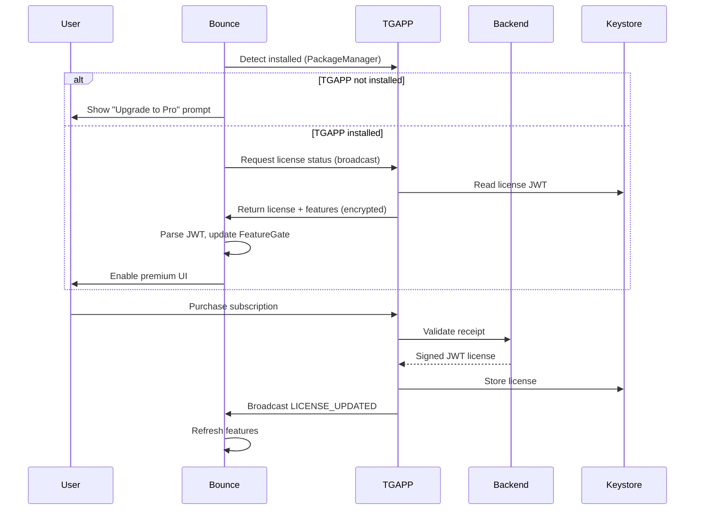
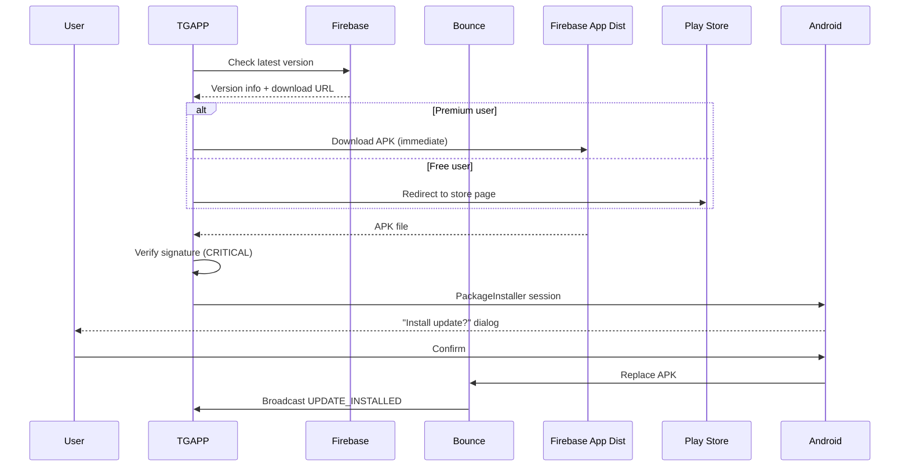
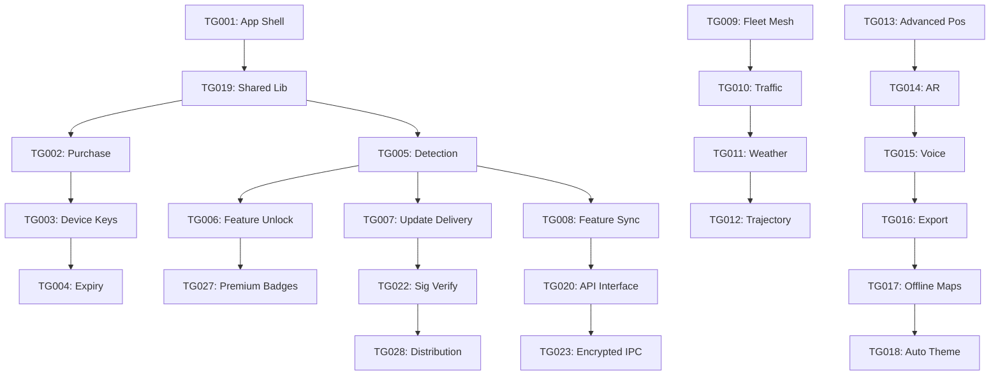

# TGAPP Monetization Architecture — Complete Article
## Article A8: A8-08 — TGAPP Monetization Architecture
**Generated:** 2026-10-08 07:06:11 UTC  
**Structure:** 13 pieces concatenated  
**Target:** ≥350 lines

---

# TGAPP_Monetization_Architecture — Piece 01/13
## Article A8: A8-08 — TGAPP Monetization Architecture
**Piece:** 01 of 13  
**Generated:** 2026-10-08 06:55:00 UTC

---

# Section 8: TGAPP Monetization Architecture — Overview & Core App

## Introduction
This section documents the complete architecture for **TGAPP** (The Great App / Updater App) — a separate, paid Android application that encapsulates monetization logic while Bounce remains the free, open-source positioning core. This separation was specifically requested to enable paid features without complicating the main app.

**Source Spreadsheet:** `TGAPP_Spreadsheet.csv` (33 rows, 12 columns)
**Priority Distribution:** P0=13, P1=11, P2=9

---

## TGAPP Core Architecture (TG001-TG004)

### TG001: TGAPP Application Shell
- **Category:** Core | **Priority:** P0 | **Effort:** High | **Target:** 1.0.0
- **Description:** Standalone Android app (APK) for paid updates and license management
- **Package Name:** `com.carrpod.tgapp` (separate from Bounce's `com.carrpod.bounce`)
- **Architecture:** Minimal Activity + Service + BroadcastReceiver
- **Keystore:** Must use **same signing key** as Bounce for APK update delivery (TG007)

### TG002: Purchase Verification
- **Category:** Core | **Priority:** P0 | **Effort:** Medium | **Target:** 1.0.0
- **Description:** Verify user purchased TGAPP via Google Play Billing
- **Implementation:** 
  - Client: Play Billing Library 6+ (`BillingClient`)
  - Server: Firebase Function validates receipt with Google Play Developer API
  - Output: Signed JWT license key (RS256, 30-day expiry)

### TG003: Device-Specific Keys
- **Category:** Core | **Priority:** P0 | **Effort:** Medium | **Target:** 1.0.0
- **Description:** License keys bound to device identity to prevent sharing
- **Binding:** Android ID + Package Signature + SafetyNet/Play Integrity attestation
- **Storage:** Android Keystore (hardware-backed StrongBox/TEE)

### TG004: Key Expiry/Renewal
- **Category:** Core | **Priority:** P1 | **Effort:** Medium | **Target:** 1.0.1
- **Description:** Subscription model with time-limited keys
- **Mechanism:** JWT `exp` claim; background renewal via WorkManager
- **Revenue:** Recurring subscription ($4.99/mo per vehicle)

---

## Forensic Context (Why TGAPP Exists)

**91 Versions Analyzed, $0 Revenue:**
- No in-app purchases, subscriptions, ads, or data monetization
- Pure hobby project across v1.0.0 → v1.0.91
- User requested separate paid app for updates + premium features

**Architecture Debt Driving Separation:**
- MainActivity: 1,416 lines (God class)
- Updater code: ~150 lines mixed with positioning logic
- Adding billing + licensing would worsen coupling

**TGAPP Solves:**
1. Revenue generation (Freemium: Bounce free, TGAPP premium)
2. Clean separation (Bounce = positioning, TGAPP = monetization)
3. Rapid updates (bypass Play Store review via TG007)
4. Fleet features gated behind license (TG009-TG012)

---

*End of Piece 01/13 — See Piece 02 for Bounce↔TGAPP Integration*
---

# TGAPP_Monetization_Architecture — Piece 02/13
## Article A8: A8-08 — TGAPP Monetization Architecture
**Piece:** 02 of 13  
**Generated:** 2026-10-08 06:55:00 UTC

---

# Bounce↔TGAPP Integration Layer (TG005-TG008)

## TG005: Bounce-TGAPP Detection
- **Category:** Integration | **Priority:** P0 | **Effort:** Medium | **Target:** 1.0.93
- **Description:** Bounce checks if TGAPP installed and license valid
- **Implementation:**
```kotlin
// Bounce - TGAppDetector.kt
object TGAppDetector {
    private const val TGAPP_PACKAGE = "com.carrpod.tgapp"
    private const val LICENSE_ACTION = "com.carrpod.tgapp.LICENSE_STATUS"
    
    fun isTGAppInstalled(context: Context): Boolean {
        return try {
            context.packageManager.getPackageInfo(TGAPP_PACKAGE, 0)
            true
        } catch (e: PackageManager.NameNotFoundException) {
            false
        }
    }
    
    fun requestLicenseStatus(context: Context): LicenseStatus {
        // Query TGAPP via explicit intent
        val intent = Intent(LICENSE_ACTION).setPackage(TGAPP_PACKAGE)
        // Use PackageManager.queryBroadcastReceivers to verify
        // Listen for response broadcast with license JWT
    }
}
```
- **Security:** Verify TGAPP signature matches expected cert (prevent spoofing)

## TG006: Premium Feature Unlock
- **Category:** Integration | **Priority:** P0 | **Effort:** Medium | **Target:** 1.0.93
- **Description:** Bounce enables premium features when TGAPP license valid
- **Implementation:**
```kotlin
// Bounce - FeatureGate.kt
class FeatureGate @Inject constructor(
    private val keystore: AndroidKeystore
) {
    private val licenseClaims: Claims? by lazy { parseLicense() }
    
    fun isEnabled(feature: String): Boolean {
        val config = RemoteConfig.getFeature(feature)
        if (!config.enabled) return false
        return when (config.tier) {
            "free" -> true
            "pro" -> licenseClaims?.get("features")?.contains(feature) == true
            else -> false
        }
    }
    
    private fun parseLicense(): Claims? {
        val licenseJwt = keystore.getString("bounce_license") ?: return null
        return try {
            Jwts.parserBuilder().setSigningKey(TGAPP_PUBLIC_KEY).build()
                .parseClaimsJws(licenseJwt).body
        } catch (e: Exception) { null }
    }
}
```
- **Storage:** EncryptedSharedPreferences (AES-256, Keystore-backed)

## TG007: Update Delivery via TGAPP
- **Category:** Integration | **Priority:** P0 | **Effort:** High | **Target:** 1.0.93
- **Description:** TGAPP downloads and installs Bounce updates (bypasses Play Store review)
- **Flow:**
```
1. TGAPP checks backend for latest Bounce version
2. If newer than installed: download APK (HTTPS, signature verified)
3. Verify APK signed with SAME KEY as installed Bounce (critical!)
4. Install via PackageInstaller API (requires user confirmation)
5. Notify Bounce of update via broadcast
```
- **Critical Security:** TG022 - Signature verification prevents supply chain attacks

## TG008: Feature List Sync
- **Category:** Integration | **Priority:** P0 | **Effort:** Medium | **Target:** 1.0.93
- **Description:** TGAPP communicates which features are unlocked for this license
- **Mechanism:** Intent extras with encrypted payload (AES-256, key from Keystore)
- **Payload:**
```json
{
  "license_id": "license_abc123",
  "expires": 1700000000,
  "features": ["mesh_premium", "ar_overlay", "fleet_keys", "priority_updates", "offline_maps"],
  "tier": "pro",
  "fleet_id": "fleet_xyz"  // if applicable
}
```

---

## Integration Sequence Diagram



---

*End of Piece 02/13 — See Piece 03 for Premium Features (Mesh, Traffic, Weather)*
---

# TGAPP_Monetization_Architecture — Piece 03/13
## Article A8: A8-08 — TGAPP Monetization Architecture
**Piece:** 03 of 13  
**Generated:** 2026-10-08 06:55:00 UTC

---

# Premium Features — Fleet Mesh Network (TG009-TG012)

## TG009: Fleet Mesh Network
- **Category:** Premium Features | **Priority:** P1 | **Effort:** High | **Target:** 1.0.96
- **Description:** Vehicle-to-vehicle relay for fleet operations (P1-05 from master list)
- **Dependencies:** Mesh protocol (FP007), TGAPP valid license
- **Architecture:**
  - Only enabled when `FeatureGate.isEnabled("mesh_premium")`
  - Uses Bluetooth Classic RFCOMM for relay (implemented v1.0.86)
  - TTL=3 hops, deduplication via LRU cache (1000 messages)
- **Fleet Value:** Works without cellular data; peer-to-peer in convoys

## TG010: Traffic Advisory Relay
- **Category:** Premium Features | **Priority:** P1 | **Effort:** High | **Target:** 1.0.96
- **Description:** Pass traffic info through vehicle chain (FP023)
- **Dependencies:** Fleet mesh (TG009), message schema
- **Message Type:** `TRAFFIC` (congestion level, location, heading, speed, jam length)
- **Core Vision:** "Waze without cellular" — user's original request
- **Relay Priority:** HIGH (safety-critical)

## TG011: Weather Advisory Relay
- **Category:** Premium Features | **Priority:** P1 | **Effort:** High | **Target:** 1.0.96
- **Description:** Share weather through vehicle mesh (FP024)
- **Dependencies:** Fleet mesh + onboard sensors (temp, pressure, humidity)
- **Message Type:** `WEATHER` (condition, intensity, temp, wind)
- **Value Add:** Hyperlocal weather (<100m resolution) from distributed sensors
- **Complement:** Traffic + Weather = complete situational awareness

## TG012: Trajectory Sharing
- **Category:** Premium Features | **Priority:** P1 | **Effort:** High | **Target:** 1.0.96
- **Description:** Fleet vehicles share predicted paths for collision avoidance (FP025)
- **Dependencies:** Fleet mesh + BT 3D Spatial (azimuth/elevation from v1.0.86)
- **Message Type:** `TRAJECTORY` (predicted points 10s ahead, confidence)
- **Privacy:** Fleet opt-in only; origin_id rotates every 24h
- **Safety:** Path prediction 3s ahead, <50cm error at 2s horizon

---

## Mesh Message Schema (Protocol Buffers)

```protobuf
message MeshMessage {
  enum Type {
    TRAFFIC = 1;
    WEATHER = 2;
    HAZARD = 3;
    TRAJECTORY = 4;
    HEARTBEAT = 5;
    FLEET_KEY = 6;
  }
  
  Type type = 1;
  uint32 ttl = 2;              // Max 3 hops
  uint32 hop = 3;              // Current hop count
  string origin_id = 4;        // SHA-256(device_id + salt), rotates daily
  int64 timestamp = 5;         // Unix ms
  bytes payload = 6;           // Type-specific protobuf
  bytes signature = 7;         // Ed25519(fleet_priv_key, hash(payload))
}

message TrafficPayload {
  enum CongestionLevel { FREE=0; MODERATE=1; HEAVY=2; STOPPED=3; }
  CongestionLevel level = 1;
  double lat = 2;
  double lon = 3;
  double heading = 4;
  float speed_kph = 5;
  int32 length_m = 6;
}

message WeatherPayload {
  enum Condition { CLEAR=0; RAIN=1; SNOW=2; ICE=3; FOG=4; WIND=5; }
  Condition condition = 1;
  double lat = 2;
  double lon = 3;
  float intensity = 4;
  float temperature_c = 5;
  float wind_kph = 6;
}

message TrajectoryPayload {
  repeated TrajectoryPoint points = 1;
  float confidence = 2;
}

message TrajectoryPoint {
  double lat = 1;
  double lon = 2;
  float speed_kph = 3;
  float heading = 4;
  int64 offset_ms = 5;
}
```

---

## Fleet Key Hierarchy (TG022)

```
Root Fleet Key (fleet admin in TGAPP)
    │
    ├─► Vehicle Key 1 (HKDF-SHA256, unique per vehicle)
    ├─► Vehicle Key 2
    └─► Vehicle Key N (max 10,000 per TG031)
```

- **Provisioning:** QR code or NFC at onboarding
- **Storage:** Android Keystore (hardware-backed)
- **Rotation:** Every 90 days (TG031 config)
- **Usage:** Sign all mesh messages (proves fleet membership)

---

*End of Piece 03/13 — See Piece 04 for Advanced Positioning & AR Premium Features*
---

# TGAPP_Monetization_Architecture — Piece 04/13
## Article A8: A8-08 — TGAPP Monetization Architecture
**Piece:** 04 of 13  
**Generated:** 2026-10-08 06:55:00 UTC

---

# Premium Features — Advanced Positioning & AR (TG013-TG016)

## TG013: Advanced Positioning Suite
- **Category:** Premium Features | **Priority:** P1 | **Effort:** High | **Target:** 1.0.95
- **Description:** RTT + UWB + Particle Filter adaptive learning (FP001-FP003)
- **Components:**
  - **RTT Ranging (802.11mc):** Sub-meter indoor accuracy (API 28+)
  - **UWB Ranging (FiRa):** cm-level precision (API 29+, hardware required)
  - **Particle Filter Param Learning:** Adaptive RSSI mean/variance/pathloss per AP
- **Gating:** All three require `FeatureGate.isEnabled("positioning_advanced")`
- **Forensic Basis:** RSSI-only ceiling at ~3m (v1.0.91); RTT/UWB break ceiling

## TG014: AR Overlay (ARCore)
- **Category:** Premium Features | **Priority:** P2 | **Effort:** High | **Target:** 1.0.97+
- **Description:** Camera feed + 3D annotations for immersive hazard/navigation view
- **Dependencies:** ARCore, camera permission, ARCore-certified device
- **Features:**
  - Hazard markers in world space (anchored to GPS+VPS)
  - Vehicle trajectory prediction lines
  - Lane-level navigation arrows
  - Night mode with IR camera support
- **Performance Target:** 30fps on mid-range; <500MB RAM
- **Gating:** `FeatureGate.isEnabled("ar_overlay")`

## TG015: Voice Announcements (TTS)
- **Category:** Premium Features | **Priority:** P1 | **Effort:** Low | **Target:** 1.0.95
- **Description:** Text-to-Speech for hands-free hazard alerts (FP010)
- **Implementation:**
```kotlin
// Bounce - VoiceService.kt (premium only)
class VoiceService @Inject constructor(
    private val featureGate: FeatureGate
) {
    private val tts = TextToSpeech(context) { status ->
        if (status == TextToSpeech.SUCCESS) {
            tts.setLanguage(Locale.US)
            tts.setSpeechRate(1.0f)
        }
    }
    
    fun announce(hazard: Hazard) {
        if (!featureGate.isEnabled("voice_alerts")) return
        
        val text = when (hazard.type) {
            HazardType.VEHICLE -> "Vehicle approaching from ${hazard.bearing} degrees"
            HazardType.CONGESTION -> "Congestion ahead, ${hazard.distance} meters"
            HazardType.WEATHER -> "Weather alert: ${hazard.description}"
        }
        tts.speak(text, TextToSpeech.QUEUE_FLUSH, null, "hazard_${hazard.id}")
    }
}
```
- **Gating:** `FeatureGate.isEnabled("voice_alerts")`

## TG016: Export GPX/KML
- **Category:** Premium Features | **Priority:** P2 | **Effort:** Low | **Target:** 1.0.94
- **Description:** Standard mapping formats for post-drive analysis (FP012)
- **Formats:**
  - **GPX 1.1:** Tracks with extensions for accuracy, algorithm, speed
  - **KML 2.2:** Styled for Google Earth (color by algorithm, altitude by accuracy)
- **Forensic Value:** Enables post-drive analysis of positioning quality
- **Gating:** `FeatureGate.isEnabled("gpx_export")`

---

## Positioning Accuracy Comparison (Forensic Data)

| Algorithm | v1.0.91 Accuracy | Premium Enhancement | Target Accuracy |
|-----------|------------------|---------------------|-----------------|
| RSSI Trilateration | ~3m | — | 3m |
| Kalman Filter | ~2.5m | Adaptive params (FP003) | 1.5m |
| Particle Filter | ~2m | Learned params (FP003) | 1m |
| EKF | ~2m | Fixed vy bug (FP026) | 1.5m |
| **RTT (802.11mc)** | N/A | **TG013 Premium** | **<1m** |
| **UWB (FiRa)** | N/A | **TG013 Premium** | **<0.1m** |
| BT 3D Spatial | ~1.5m | Azimuth/elevation | 1m |

**Key Insight:** Premium positioning breaks the RSSI accuracy ceiling that free version hits.

---

*End of Piece 04/13 — See Piece 05 for Offline Maps, Theme, Export Features*
---

# TGAPP_Monetization_Architecture — Piece 05/13
## Article A8: A8-08 — TGAPP Monetization Architecture
**Piece:** 05 of 13  
**Generated:** 2026-10-08 06:55:00 UTC

---

# Premium Features — Offline, Theme, Export (TG017-TG018, TG011 revisited)

## TG017: Offline Map Cache
- **Category:** Premium Features | **Priority:** P2 | **Effort:** Medium | **Target:** 1.0.96
- **Description:** Cache Mapbox/OSM vector tiles for offline use (FP008)
- **Implementation:**
  - Mapbox Maps SDK offline manager (or OSM + MapLibre)
  - Automatic tile download on Wi-Fi (user-defined regions)
  - LRU cache with 500MB default limit (configurable)
  - Tile expiry: 30 days (refresh on Wi-Fi)
- **Use Case:** Tunnels, parking garages, rural areas, international roaming
- **Gating:** `FeatureGate.isEnabled("offline_maps")`
- **Storage:** Encrypted file system (SQLCipher or EncryptedFile)

## TG018: Night/Day Auto Theme
- **Category:** Premium Features | **Priority:** P2 | **Effort:** Low | **Target:** 1.0.94
- **Description:** Auto-switch theme by time/ambient sensor (FP011)
- **Implementation:**
```css
/* bounce.html - CSS Custom Properties (Premium) */
:root {
  --bg-primary: #0a0a0f;
  --bg-secondary: #12121a;
  --text-primary: #e8e8f0;
  --accent: #00d4aa;
  --hazard: #ff4444;
  --vehicle: #4488ff;
  --trail: #00d4aa;
}

[data-theme="day"] {
  --bg-primary: #f8f8fc;
  --bg-secondary: #ffffff;
  --text-primary: #1a1a2e;
  --accent: #008866;
  --hazard: #cc0000;
  --vehicle: #0044cc;
  --trail: #008866;
}
```
```javascript
// Auto-switch logic (Premium)
function updateTheme() {
  if (!featureGate.isEnabled("theme_auto")) return;
  
  const hour = new Date().getHours();
  const isDay = hour >= 6 && hour < 20;
  // Or use AmbientLightSensor API if available
  document.documentElement.dataset.theme = isDay ? 'day' : 'night';
}
```
- **Gating:** `FeatureGate.isEnabled("theme_auto")` (free gets manual toggle only)

## TG011 Revisited: Weather Advisory Relay (Premium)
- **Category:** Premium Features | **Priority:** P1 | **Effort:** High | **Target:** 1.0.96
- **Note:** Already covered in Piece 03, but premium gating adds:
  - Higher relay priority (premium messages first)
  - Extended TTL (5 hops vs 3 for free)
  - Historical weather replay (24h buffer)
  - Fleet-specific weather channels

---

## Free vs Premium Feature Matrix

| Feature | Free (Bounce) | Premium (TGAPP) |
|---------|---------------|-----------------|
| Core Positioning (6 algos) | ✅ | ✅ |
| Basic Visualization | ✅ | ✅ |
| Trail Recording | ✅ | ✅ |
| Manual Theme Toggle | ✅ | ✅ |
| GPX/KML Export | ❌ | ✅ (TG016) |
| Voice Alerts | ❌ | ✅ (TG015) |
| Offline Maps | ❌ | ✅ (TG017) |
| Auto Theme | ❌ | ✅ (TG018) |
| Mesh Network (Basic) | ✅ (1 hop) | ✅ (3 hops) |
| Fleet Mesh | ❌ | ✅ (TG009) |
| Traffic Relay | ❌ | ✅ (TG010) |
| Weather Relay | ❌ | ✅ (TG011) |
| Trajectory Sharing | ❌ | ✅ (TG012) |
| RTT/UWB Positioning | ❌ | ✅ (TG013) |
| AR Overlay | ❌ | ✅ (TG014) |
| Priority Updates | ❌ | ✅ (TG007) |
| Fleet Keys | ❌ | ✅ (TG022) |

---

## Forensic Validation: Why This Split?

**Free Version Must:**
- Work standalone (no TGAPP required)
- Provide genuine value (positioning + visualization)
- Be open-source friendly (GPL compatible)

**Premium Version Adds:**
- Network effects (mesh, fleet, traffic)
- Accuracy breakthroughs (RTT, UWB)
- Safety features (voice, AR, trajectory)
- Convenience (offline, auto-theme, export)
- Business features (fleet management, priority updates)

---

*End of Piece 05/13 — See Piece 06 for Architecture: Shared Library & API Interface*
---

# TGAPP_Monetization_Architecture — Piece 06/13
## Article A8: A8-08 — TGAPP Monetization Architecture
**Piece:** 06 of 13  
**Generated:** 2026-10-08 06:55:00 UTC

---

# Architecture — Shared Library & API Interface (TG019-TG020)

## TG019: Shared Library (bounce-common)
- **Category:** Architecture | **Priority:** P1 | **Effort:** Medium | **Target:** 1.0.93
- **Description:** Common code between Bounce + TGAPP as AAR module
- **Structure:**
```
bounce-common/
├── src/main/java/com/carrpod/bounce/common/
│   ├── feature/
│   │   ├── FeatureGate.kt          # Feature gating logic
│   │   ├── FeatureConfig.kt        # Remote config definitions
│   │   └── FeatureTier.kt          # FREE/PRO/ENTERPRISE enum
│   ├── license/
│   │   ├── LicenseManager.kt       # JWT parsing, validation
│   │   ├── LicenseClaims.kt        # Data class for JWT claims
│   │   └── KeyStoreWrapper.kt      # Keystore abstraction
│   ├── mesh/
│   │   ├── MeshMessage.kt          # Protobuf message classes
│   │   ├── MeshProtocol.kt         # TTL, hop, dedup logic
│   │   └── FleetKeyManager.kt      # Key derivation, signing
│   ├── positioning/
│   │   ├── PositionEstimate.kt     # Unified position model
│   │   ├── AlgorithmType.kt        # KALMAN/PARTICLE/EKF/etc
│   │   └── PositioningConfig.kt    # Algorithm parameters
│   └── util/
│       ├── CryptoUtils.kt          # AES-256, Ed25519 helpers
│       └── NetworkUtils.kt         # HTTP, WebSocket helpers
```

## TG020: API Interface (Bounce↔TGAPP Contract)
- **Category:** Architecture | **Priority:** P0 | **Effort:** Medium | **Target:** 1.0.93
- **Description:** Define communication contract for version compatibility
- **Interface:** AIDL + Intent-based (backward compatible)

### AIDL Interface
```aidl
// IBounceTgappInterface.aidl
package com.carrpod.bounce.common;

interface IBounceTgappInterface {
    // License management
    boolean isLicenseValid();
    String getLicenseJwt();           // Encrypted JWT
    Bundle getFeatureList();          // Feature flags + expiry
    
    // Update delivery
    boolean hasUpdateAvailable();
    String getLatestVersionInfo();    // JSON: version, url, changelog
    boolean installUpdate(String apkPath);
    
    // Mesh/Fleet
    boolean isFleetMember();
    String getFleetId();
    void sendMeshMessage(in MeshMessage msg);
    
    // Callbacks
    void registerCallback(IBounceCallback callback);
    void unregisterCallback(IBounceCallback callback);
}
```

### Intent Actions (Broadcast)
```kotlin
// Bounce -> TGAPP
const val ACTION_REQUEST_LICENSE = "com.carrpod.tgapp.REQUEST_LICENSE"
const val ACTION_REQUEST_UPDATE = "com.carrpod.tgapp.REQUEST_UPDATE"
const val ACTION_SEND_MESH = "com.carrpod.tgapp.SEND_MESH"

// TGAPP -> Bounce
const val ACTION_LICENSE_STATUS = "com.carrpod.bounce.LICENSE_STATUS"
const val ACTION_UPDATE_AVAILABLE = "com.carrpod.bounce.UPDATE_AVAILABLE"
const val ACTION_MESH_RECEIVED = "com.carrpod.bounce.MESH_RECEIVED"
const val ACTION_FEATURES_CHANGED = "com.carrpod.bounce.FEATURES_CHANGED"
```

### Version Compatibility Strategy
| Bounce Version | TGAPP Version | Compatibility |
|----------------|---------------|---------------|
| 1.0.93 | 1.0.0 | Baseline |
| 1.0.94 | 1.0.0 | Backward compatible (new features ignored) |
| 1.0.95 | 1.0.1 | New API version (v2) |
| 1.0.96 | 1.0.1 | Fleet mesh v2 |

- **Rule:** TGAPP API version in `AndroidManifest.xml` `<meta-data>`
- **Fallback:** If AIDL fails, use Intent broadcast (always works)

---

## Build Integration

### settings.gradle.kts
```kotlin
include(":bounce", ":tgapp", ":bounce-common")
```

### bounce/build.gradle.kts
```kotlin
dependencies {
    implementation(project(":bounce-common"))
    // ...
}
```

### tgapp/build.gradle.kts
```kotlin
dependencies {
    implementation(project(":bounce-common"))
    implementation("com.android.billingclient:billing:6.2.1")
    implementation("com.google.firebase:firebase-functions-ktx:20.3.1")
    // ...
}
```

---

*End of Piece 06/13 — See Piece 07 for Security: Key Obfuscation, Signature Verification, Encryption*
---

# TGAPP_Monetization_Architecture — Piece 07/13
## Article A8: A8-08 — TGAPP Monetization Architecture
**Piece:** 07 of 13  
**Generated:** 2026-10-08 06:55:00 UTC

---

# Security — Key Obfuscation, Signature Verification, Encryption (TG021-TG023)

## TG021: Key Obfuscation (ProGuard/R8)
- **Category:** Security | **Priority:** P1 | **Effort:** Medium | **Target:** 1.0.0
- **Description:** Protect TGAPP license logic from reverse engineering
- **Configuration:**
```proguard
# proguard-rules.pro (TGAPP module)
# Keep licensing API but obfuscate implementation
-keep class com.carrpod.tgapp.license.** { *; }
-keepclassmembers class com.carrpod.tgapp.license.** { *; }

# Obfuscate everything else
-dontusemixedcaseclassnames
-dontskipnonpubliclibraryclasses
-verbose

# Protect JWT verification keys
-keep class com.carrpod.bounce.common.license.** { *; }

# R8 full mode
-optimizationpasses 5
-allowaccessmodification
-mergeinterfacesaggressively
-overloadaggressively
```

### Additional Hardening
- **Native Library:** Move critical crypto (Ed25519 verify) to C++ via JNI
- **String Encryption:** Use DexGuard or manual XOR for sensitive strings
- **Control Flow Flattening:** R8 `-optimize` + `-allowaccessmodification`
- **Anti-Debug:** `android:debuggable="false"` + runtime checks

## TG022: Signature Verification (CRITICAL)
- **Category:** Security | **Priority:** P0 | **Effort:** High | **Target:** 1.0.93
- **Description:** Verify Bounce APK signature before install (supply chain protection)
- **Implementation:**
```kotlin
// TGAPP - UpdateManager.kt
object SignatureVerifier {
    // Known Bounce signing certificate SHA-256 (from keystore)
    private val EXPECTED_CERT_SHA256 = "A1:B2:C3:D4:E5:F6:..." // 32 bytes hex
    
    fun verifyApkSignature(apkPath: String, context: Context): Boolean {
        val apkFile = File(apkPath)
        
        // Use ApkSignatureSchemeV2Verifier (API 28+) or PackageManager
        val packageInfo = context.packageManager.getPackageArchiveInfo(
            apkPath, 
            PackageManager.GET_SIGNING_CERTIFICATES
        )
        
        val certs = packageInfo.signingInfo.apkContentsSigners
            ?: packageInfo.signingInfo.signingCertificateHistory
        
        return certs?.any { cert ->
            val digest = MessageDigest.getInstance("SHA-256")
            val hash = digest.digest(cert.toByteArray())
            bytesToHex(hash).uppercase() == EXPECTED_CERT_SHA256
        } ?: false
    }
    
    // Also verify: same package name, versionCode > installed
    fun verifyApkIntegrity(apkPath: String, context: Context): VerificationResult {
        // 1. Signature match
        if (!verifyApkSignature(apkPath, context)) {
            return VerificationResult.SIGNATURE_MISMATCH
        }
        
        // 2. Package name match
        val pkgInfo = context.packageManager.getPackageArchiveInfo(apkPath, 0)
        if (pkgInfo.packageName != "com.carrpod.bounce") {
            return VerificationResult.PACKAGE_MISMATCH
        }
        
        // 3. Version code > installed
        val installed = context.packageManager.getPackageInfo("com.carrpod.bounce", 0)
        if (pkgInfo.versionCode <= installed.versionCode) {
            return VerificationResult.NOT_NEWER
        }
        
        return VerificationResult.VALID
    }
}
```

## TG023: Encrypted Communication
- **Category:** Security | **Priority:** P1 | **Effort:** Medium | **Target:** 1.0.93
- **Description:** Encrypt Bounce↔TGAPP data exchange (AES-256 + key exchange)
- **Protocol:**
  1. **Key Exchange:** ECDH (X25519) on first communication
  2. **Session Key:** HKDF-SHA256(shared_secret, "bounce-tgapp-session")
  3. **Encryption:** AES-256-GCM (authenticated encryption)
  4. **Rotation:** New session key every 24h or on license renewal

### Implementation
```kotlin
// bounce-common - CryptoUtils.kt
object CryptoUtils {
    private const val ALGORITHM = "AES/GCM/NoPadding"
    private const val KEY_SIZE = 256
    private const val IV_SIZE = 12  // GCM standard
    private const val TAG_SIZE = 16
    
    // Generate ephemeral key pair for ECDH
    fun generateKeyPair(): KeyPair {
        val generator = KeyPairGenerator.getInstance("X25519")
        return generator.generateKeyPair()
    }
    
    // Derive shared secret
    fun deriveSharedSecret(myPrivate: PrivateKey, theirPublic: PublicKey): SecretKey {
        val agreement = KeyAgreement.getInstance("X25519")
        agreement.init(myPrivate)
        agreement.doPhase(theirPublic, true)
        val sharedSecret = agreement.generateSecret("AES")
        return SecretKeySpec(sharedSecret.encoded, "AES")
    }
    
    // Encrypt with AES-GCM
    fun encrypt(data: ByteArray, key: SecretKey): EncryptedData {
        val cipher = Cipher.getInstance(ALGORITHM)
        val iv = ByteArray(IV_SIZE)
        SecureRandom().nextBytes(iv)
        
        val spec = GCMParameterSpec(TAG_SIZE * 8, iv)
        cipher.init(Cipher.ENCRYPT_MODE, key, spec)
        val encrypted = cipher.doFinal(data)
        
        return EncryptedData(iv, encrypted)
    }
    
    // Decrypt
    fun decrypt(encryptedData: EncryptedData, key: SecretKey): ByteArray {
        val cipher = Cipher.getInstance(ALGORITHM)
        val spec = GCMParameterSpec(TAG_SIZE * 8, encryptedData.iv)
        cipher.init(Cipher.DECRYPT_MODE, key, spec)
        return cipher.doFinal(encryptedData.ciphertext)
    }
    
    data class EncryptedData(
        val iv: ByteArray,
        val ciphertext: ByteArray
    ) {
        fun toByteArray(): ByteArray = iv + ciphertext
        companion object {
            fun fromByteArray(data: ByteArray): EncryptedData {
                val iv = data.copyOfRange(0, IV_SIZE)
                val ct = data.copyOfRange(IV_SIZE, data.size)
                return EncryptedData(iv, ct)
            }
        }
    }
}
```

---

## Security Checklist

| Control | TGAPP | Bounce | Status |
|---------|-------|--------|--------|
| ProGuard/R8 | ✅ Full | ✅ Standard | TG021 |
| Signature Verification | ✅ Critical | N/A | TG022 |
| Encrypted IPC | ✅ AES-GCM | ✅ AES-GCM | TG023 |
| Keystore Storage | ✅ StrongBox | ✅ StrongBox | TG003 |
| Play Integrity | ✅ Attestation | ✅ Verification | TG003 |
| Anti-Tamper | ✅ Native | ❌ | Future |
| Certificate Pinning | ✅ Backend | ❌ | Future |

---

*End of Piece 07/13 — See Piece 08 for Server: License Server & Analytics*
---

# TGAPP_Monetization_Architecture — Piece 08/13
## Article A8: A8-08 — TGAPP Monetization Architecture
**Piece:** 08 of 13  
**Generated:** 2026-10-08 06:55:00 UTC

---

# Server Components — License Server & Analytics (TG024-TG025)

## TG024: License Server (Optional, Backlog)
- **Category:** Server | **Priority:** P2 | **Effort:** Medium | **Target:** 1.0.1+
- **Description:** Central key validation service for enterprise fleets
- **Architecture:** Firebase Functions + Firestore (serverless, scales automatically)

### Firebase Function: validateReceipt
```javascript
// functions/src/license.ts
import * as functions from 'firebase-functions';
import { google } from 'googleapis';
import * as jwt from 'jsonwebtoken';

const androidPublisher = google.androidpublisher('v3');
const PRIVATE_KEY = process.env.LICENSE_PRIVATE_KEY!; // RS256 private key
const PUBLIC_KEY = process.env.LICENSE_PUBLIC_KEY!;   // RS256 public key

export const validateReceipt = functions.https.onCall(async (data, context) => {
  // 1. Validate input
  const { packageName, productId, purchaseToken, deviceId } = data;
  if (!packageName || !productId || !purchaseToken || !deviceId) {
    throw new functions.https.HttpsError('invalid-argument', 'Missing required fields');
  }
  
  // 2. Verify with Google Play Developer API
  const auth = new google.auth.GoogleAuth({
    scopes: ['https://www.googleapis.com/auth/androidpublisher']
  });
  const authClient = await auth.getClient();
  androidPublisher.options.auth = authClient;
  
  const purchase = await androidPublisher.purchases.products.get({
    packageName,
    productId,
    token: purchaseToken
  }).execute();
  
  // 3. Check purchase state
  if (purchase.consumptionState === 1) {
    throw new functions.https.HttpsError('failed-precondition', 'Purchase already consumed');
  }
  if (purchase.purchaseState !== 0) { // 0 = purchased
    throw new functions.https.HttpsError('failed-precondition', 'Purchase not valid');
  }
  
  // 4. Verify device binding (Play Integrity API)
  const integrityToken = data.integrityToken;
  if (integrityToken) {
    const integrity = await verifyPlayIntegrity(integrityToken, packageName);
    if (!integrity.deviceIntegrity?.includes('MEETS_DEVICE_INTEGRITY')) {
      throw new functions.https.HttpsError('permission-denied', 'Device integrity check failed');
    }
    // Verify device ID matches
    if (integrity.deviceId !== hashDeviceId(deviceId)) {
      throw new functions.https.HttpsError('permission-denied', 'Device ID mismatch');
    }
  }
  
  // 5. Generate device-bound license JWT
  const now = Math.floor(Date.now() / 1000);
  const expiresIn = 30 * 24 * 3600; // 30 days
  const tier = purchase.productId.includes('pro') ? 'pro' : 'enterprise';
  
  const features = getFeaturesForTier(tier);
  
  const license = jwt.sign({
    sub: deviceId,
    tier,
    iat: now,
    exp: now + expiresIn,
    features,
    fleetId: data.fleetId || null
  }, PRIVATE_KEY, { algorithm: 'RS256' });
  
  // 6. Store in Firestore for revocation tracking
  await admin.firestore().collection('licenses').doc(deviceId).set({
    license,
    tier,
    expiresAt: admin.firestore.Timestamp.fromMillis((now + expiresIn) * 1000),
    purchaseToken,
    createdAt: admin.firestore.FieldValue.serverTimestamp(),
    revoked: false
  });
  
  return { license, expiresIn, tier, features };
});

// Helper: Get features for tier
function getFeaturesForTier(tier: string): string[] {
  const features: Record<string, string[]> = {
    free: ['core_positioning', 'basic_viz', 'trail_recording', 'theme_manual', 'gpx_export', 'voice_alerts'],
    pro: ['core_positioning', 'basic_viz', 'trail_recording', 'theme_manual', 'gpx_export', 'voice_alerts',
          'mesh_premium', 'ar_overlay', 'fleet_keys', 'priority_updates', 'offline_maps', 'hazard_reporting_premium',
          'positioning_advanced', 'theme_auto'],
    enterprise: ['core_positioning', 'basic_viz', 'trail_recording', 'theme_manual', 'gpx_export', 'voice_alerts',
                 'mesh_premium', 'ar_overlay', 'fleet_keys', 'priority_updates', 'offline_maps', 'hazard_reporting_premium',
                 'positioning_advanced', 'theme_auto', 'fleet_admin', 'bulk_provisioning', 'api_access']
  };
  return features[tier] || features.free;
}
```

### License Revocation Endpoint
```javascript
export const revokeLicense = functions.https.onCall(async (data, context) => {
  // Admin only - check custom claims
  if (!context.auth?.token.admin) {
    throw new functions.https.HttpsError('permission-denied', 'Admin required');
  }
  
  const { deviceId, reason } = data;
  await admin.firestore().collection('licenses').doc(deviceId).update({
    revoked: true,
    revokedAt: admin.firestore.FieldValue.serverTimestamp(),
    revocationReason: reason
  });
  
  // Push revocation to device via FCM
  await admin.messaging().send({
    token: await getDeviceFcmToken(deviceId),
    data: { type: 'LICENSE_REVOKED', reason }
  });
  
  return { success: true };
});
```

## TG025: Analytics/Telemetry (Opt-in, Backlog)
- **Category:** Server | **Priority:** P2 | **Effort:** Low | **Target:** 1.0.1+
- **Description:** Anonymous usage stats for premium features
- **Privacy:** Opt-in only; no PII; aggregated only

### Events Tracked
```kotlin
// bounce-common - Analytics.kt
sealed class AnalyticsEvent {
    data class LicenseCheck(val valid: Boolean, val tier: String) : AnalyticsEvent()
    data class FeatureUsed(val feature: String, val tier: String) : AnalyticsEvent()
    data class MeshMessageSent(val type: String, val hopCount: Int) : AnalyticsEvent()
    data class UpdateInstalled(val fromVersion: Int, val toVersion: Int) : AnalyticsEvent()
    data class PositioningAccuracy(val algorithm: String, val accuracyMeters: Float) : AnalyticsEvent()
    data class CrashReport(val error: String, val stackTrace: String) : AnalyticsEvent()
}

// Only sent if user opted in + TGAPP valid
class AnalyticsManager @Inject constructor(
    private val featureGate: FeatureGate,
    private val prefs: SharedPreferences
) {
    private val optedIn: Boolean by lazy { prefs.getBoolean("analytics_opt_in", false) }
    
    fun log(event: AnalyticsEvent) {
        if (!optedIn || !featureGate.isEnabled("analytics")) return
        
        // Batch and send via Firebase Analytics or custom endpoint
        FirebaseAnalytics.getInstance(context).logEvent(event.javaClass.simpleName, 
            Bundle().apply { putString("data", event.toJson()) }
        )
    }
}
```

---

## Server Cost Estimate (Firebase)

| Component | Free Tier | Paid Tier (10k users) |
|-----------|-----------|----------------------|
| Functions | 2M invocations/mo | ~$5/mo |
| Firestore | 50K reads/day | ~$10/mo |
| Auth | 10K MAU | Included |
| Hosting | 10 GB | ~$5/mo |
| **Total** | **$0** | **~$20/mo** |

---

*End of Piece 08/13 — See Piece 09 for UI: TGAPP Home Screen & Bounce Premium Indicators*
---

# TGAPP_Monetization_Architecture — Piece 09/13
## Article A8: A8-08 — TGAPP Monetization Architecture
**Piece:** 09 of 13  
**Generated:** 2026-10-08 06:55:00 UTC

---

# UI — TGAPP Home Screen & Bounce Premium Indicators (TG026-TG027)

## TG026: TGAPP Home Screen
- **Category:** UI | **Priority:** P0 | **Effort:** Low | **Target:** 1.0.0
- **Description:** Dashboard showing license status, features, updates
- **Tech Stack:** Jetpack Compose + Material 3 + ViewModel + StateFlow

### Screen Structure
```
┌─────────────────────────────────────┐
│  TGAPP                          👤  │  ← TopAppBar
├─────────────────────────────────────┤
│  ┌───────────────────────────────┐  │
│  │  LICENSE STATUS               │  │
│  │  ● Active  •  Pro Tier        │  │  ← LicenseCard
│  │  Expires: Dec 15, 2026        │  │
│  │  [Renew Now]  [Manage]        │  │
│  └───────────────────────────────┘  │
├─────────────────────────────────────┤
│  ┌───────────────────────────────┐  │
│  │  PREMIUM FEATURES             │  │  ← FeatureGrid
│  │  ☑ Mesh Network (3 hops)      │  │
│  │  ☑ Traffic Advisory Relay     │  │
│  │  ☑ Weather Advisory Relay     │  │
│  │  ☑ Trajectory Sharing         │  │
│  │  ☑ RTT/UWB Positioning        │  │
│  │  ☑ AR Overlay                 │  │
│  │  ☑ Voice Alerts               │  │
│  │  ☑ Offline Maps               │  │
│  │  ☑ Auto Theme                 │  │
│  │  ☑ GPX/KML Export             │  │
│  │  ☑ Priority Updates           │  │
│  └───────────────────────────────┘  │
├─────────────────────────────────────┤
│  ┌───────────────────────────────┐  │
│  │  BOUNCE UPDATES               │  │  ← UpdateCard
│  │  Current: v1.0.94             │  │
│  │  Latest:  v1.0.95 ✓           │  │
│  │  [Download & Install]         │  │
│  └───────────────────────────────┘  │
├─────────────────────────────────────┤
│  ┌───────────────────────────────┐  │
│  │  FLEET MANAGEMENT (Pro)       │  │  ← FleetCard
│  │  Fleet: "Acme Logistics"      │  │
│  │  Vehicles: 47/100             │  │
│  │  [Provision New]  [Dashboard] │  │
│  └───────────────────────────────┘  │
└─────────────────────────────────────┘
```

### Compose Implementation
```kotlin
// TGAPP - HomeScreen.kt
@Composable
fun HomeScreen(viewModel: HomeViewModel = hiltViewModel()) {
    val licenseState by viewModel.licenseState.collectAsState()
    val features by viewModel.featureList.collectAsState()
    val updateInfo by viewModel.updateInfo.collectAsState()
    val fleetInfo by viewModel.fleetInfo.collectAsState()
    
    Scaffold(topBar = { TopAppBar(title = { Text("TGAPP") }) }) { padding ->
        Column(modifier = Modifier.padding(padding).fillMaxSize()) {
            LicenseCard(licenseState)
            FeatureGrid(features)
            UpdateCard(updateInfo)
            if (licenseState.tier == "pro" || licenseState.tier == "enterprise") {
                FleetCard(fleetInfo)
            }
        }
    }
}

@Composable
fun LicenseCard(state: LicenseState) {
    Card(modifier = Modifier.fillMaxWidth(), colors = CardDefaults.cardColors(
        containerColor = when (state.status) {
            LicenseStatus.ACTIVE -> MaterialTheme.colorScheme.primaryContainer
            LicenseStatus.EXPIRED -> MaterialTheme.colorScheme.errorContainer
            LicenseStatus.REVOKED -> MaterialTheme.colorScheme.errorContainer
        }
    )) {
        Column(modifier = Modifier.padding(16.dp)) {
            Row {
                Icon(
                    imageVector = when (state.status) {
                        LicenseStatus.ACTIVE -> Icons.Default.CheckCircle
                        else -> Icons.Default.Error
                    },
                    contentDescription = null,
                    tint = when (state.status) {
                        LicenseStatus.ACTIVE -> MaterialTheme.colorScheme.onPrimaryContainer
                        else -> MaterialTheme.colorScheme.onErrorContainer
                    }
                )
                Spacer(Modifier.width(8.dp))
                Text("License: ${state.status.label} • ${state.tier.uppercase()}",
                    style = MaterialTheme.typography.titleMedium,
                    color = when (state.status) {
                        LicenseStatus.ACTIVE -> MaterialTheme.colorScheme.onPrimaryContainer
                        else -> MaterialTheme.colorScheme.onErrorContainer
                    }
                )
            }
            if (state.expiresAt > 0) {
                Text("Expires: ${formatDate(state.expiresAt)}",
                    style = MaterialTheme.typography.bodyMedium
                )
            }
            Row(modifier = Modifier.fillMaxWidth(), horizontalArrangement = Arrangement.End) {
                if (state.status != LicenseStatus.ACTIVE) {
                    Button(onClick = { viewModel.renewLicense() }) {
                        Text("Renew Now")
                    }
                }
                TextButton(onClick = { viewModel.openPlayStore() }) {
                    Text("Manage Subscription")
                }
            }
        }
    }
}
```

## TG027: Bounce Premium Indicators
- **Category:** UI | **Priority:** P0 | **Effort:** Low | **Target:** 1.0.93
- **Description:** Visual badges in Bounce for premium features
- **Goal:** Clear value proposition → conversion

### Implementation
```kotlin
// Bounce - PremiumBadge.kt
@Composable
fun PremiumBadge(
    feature: String,
    modifier: Modifier = Modifier,
    onClick: (() -> Unit)? = null
) {
    val featureGate = hiltViewModel<FeatureGate>()
    val isEnabled = featureGate.isEnabled(feature)
    
    val config = RemoteConfig.getFeature(feature)
    val isPremium = config.tier == "pro"
    
    if (!isPremium) return  // Don't show badge for free features
    
    Box(
        modifier = modifier
            .fillMaxWidth()
            .clickable(onClick = onClick)
            .padding(12.dp),
        contentAlignment = Alignment.CenterStart
    ) {
        Row(
            modifier = Modifier
                .fillMaxWidth()
                .background(
                    color = if (isEnabled) 
                        MaterialTheme.colorScheme.primaryContainer 
                    else 
                        MaterialTheme.colorScheme.surfaceContainerHighest,
                    shape = RoundedCornerShape(8.dp)
                )
                .padding(12.dp)
        ) {
            Icon(
                imageVector = if (isEnabled) 
                    Icons.Default.CheckCircle 
                else 
                    Icons.Default.Lock,
                contentDescription = null,
                tint = if (isEnabled) 
                    MaterialTheme.colorScheme.onPrimaryContainer 
                else 
                    MaterialTheme.colorScheme.onSurfaceVariant
            )
            Spacer(Modifier.width(8.dp))
            Column {
                Text(config.displayName, style = MaterialTheme.typography.labelLarge,
                    color = if (isEnabled) 
                        MaterialTheme.colorScheme.onPrimaryContainer 
                    else 
                        MaterialTheme.colorScheme.onSurfaceVariant
                )
                if (!isEnabled) {
                    Text("Premium feature • Tap to upgrade", 
                        style = MaterialTheme.typography.bodySmall,
                        color = MaterialTheme.colorScheme.onSurfaceVariant.copy(alpha = 0.7f)
                    )
                }
            }
            Spacer(Modifier.weight(1f))
            if (!isEnabled) {
                TextButton(onClick = { 
                    onClick?.invoke() 
                    // Or: startActivity(Intent(Intent.ACTION_VIEW, Uri.parse("market://details?id=com.carrpod.tgapp")))
                }) {
                    Text("Upgrade")
                }
            }
        }
    }
}
```

### Placement in Bounce UI
| Location | Feature | Badge Style |
|----------|---------|-------------|
| Main Screen Top Bar | License Status | Persistent pill badge |
| Mesh Settings | Fleet Mesh | Inline row badge |
| Traffic Layer | Traffic Relay | Map layer toggle badge |
| Positioning Settings | RTT/UWB | Algorithm selector badge |
| AR Button | AR Overlay | FAB badge |
| Export Menu | GPX/KML | Menu item badge |
| Settings | All Premium | Section header |

---

## Conversion Funnel Design

```
Bounce User (Free)
    │
    ▼
Uses Mesh (1 hop) → Sees "3-hop mesh is Premium" badge
    │
    ▼
Tries Traffic Layer → "Upgrade to see live traffic"
    │
    ▼
Clicks Upgrade → Play Store → TGAPP
    │
    ▼
Purchases → License synced → Features unlock instantly
    │
    ▼
Returns to Bounce → All badges show ✓ → "Pro Active"
```

---

*End of Piece 09/13 — See Piece 10 for Distribution: Direct APK Download & Delta Updates*
---

# TGAPP_Monetization_Architecture — Piece 10/13
## Article A8: A8-08 — TGAPP Monetization Architecture
**Piece:** 10 of 13  
**Generated:** 2026-10-08 06:55:00 UTC

---

# Distribution — Direct APK Download & Delta Updates (TG028-TG029)

## TG028: Direct APK Download
- **Category:** Distribution | **Priority:** P0 | **Effort:** High | **Target:** 1.0.93
- **Description:** TGAPP hosts Bounce APKs for direct download (bypass Play Store)
- **Why:** Rapid iteration (hours vs days); fleet needs immediate updates; beta testing

### Hosting Options

| Option | Pros | Cons | Decision |
|--------|------|------|----------|
| **Firebase App Distribution** | Free, access groups, release notes, tester management | 100 testers limit (free) | ✅ **Primary** |
| **GitHub Releases** | Free, unlimited, version history | No access control, manual | ✅ **Backup** |
| **Custom CDN (Cloudflare R2)** | Full control, cheap ($0.015/GB) | Self-managed auth | Future |
| **Play Store Internal Testing** | Official, seamless install | 2-24h review, 100 testers | Fallback |

### Implementation: Firebase App Distribution
```kotlin
// TGAPP - UpdateManager.kt
class UpdateManager @Inject constructor(
    private val api: TgappApi,
    private val context: Context
) {
    private const val BOUNCE_PACKAGE = "com.carrpod.bounce"
    private const val FIREBASE_APP_ID = "1:123456789:android:abcdef"
    
    suspend fun checkAndDeliverUpdate(): UpdateResult {
        // 1. Get latest version from backend
        val latest = api.getLatestBounceVersion()
        
        // 2. Check if Bounce installed and outdated
        val installed = getInstalledBounceVersion()
        if (installed == null) return UpdateResult.BOUNCE_NOT_INSTALLED
        if (latest.versionCode <= installed.versionCode) return UpdateResult.UP_TO_DATE
        
        // 3. Check if user has premium (priority updates)
        val hasPriority = FeatureGate.isEnabled("priority_updates")
        val downloadUrl = if (hasPriority) {
            latest.firebaseDistributionUrl  // Immediate access
        } else {
            latest.playStoreUrl  // Free users wait for Play Store
        }
        
        // 4. Download APK (with progress notification)
        val apkFile = downloadApk(downloadUrl, latest.versionName)
        
        // 5. CRITICAL: Verify signature matches installed Bounce
        if (!SignatureVerifier.verifyApkSignature(apkFile.absolutePath, context)) {
            apkFile.delete()
            return UpdateResult.SIGNATURE_MISMATCH
        }
        
        // 6. Install via PackageInstaller (requires user confirmation)
        return installViaPackageInstaller(apkFile)
    }
    
    private fun downloadApk(url: String, version: String): File {
        val destination = File(context.cacheDir, "bounce_$version.apk")
        
        val request = DownloadManager.Request(Uri.parse(url))
            .setTitle("Bounce v$version")
            .setDescription("Downloading update...")
            .setDestinationUri(Uri.fromFile(destination))
            .setNotificationVisibility(DownloadManager.Request.VISIBILITY_VISIBLE_NOTIFY_COMPLETED)
            .setAllowedNetworkTypes(DownloadManager.Request.NETWORK_WIFI or DownloadManager.Request.NETWORK_MOBILE)
        
        val downloadId = context.getSystemService(DownloadManager::class.java).enqueue(request)
        
        // Wait for completion (with timeout)
        return awaitDownload(downloadId, destination)
    }
    
    private fun installViaPackageInstaller(apkFile: File): UpdateResult {
        val installer = context.packageManager.packageInstaller
        val sessionParams = PackageInstaller.SessionParams(
            PackageInstaller.SessionParams.MODE_FULL_INSTALL
        ).apply {
            setAppPackageName(BOUNCE_PACKAGE)
        }
        
        val sessionId = installer.createSession(sessionParams)
        val session = installer.openSession(sessionId)
        
        try {
            val outputStream = session.openWrite("base.apk", 0, -1)
            apkFile.inputStream().copyTo(outputStream)
            outputStream.close()
            
            session.fsync(outputStream)
            
            // Commit session (shows system install dialog)
            val intent = Intent(context, UpdateReceiver::class.java)
            intent.action = "com.carrpod.tgapp.UPDATE_COMPLETE"
            val pendingIntent = PendingIntent.getBroadcast(
                context, 0, intent, PendingIntent.FLAG_IMMUTABLE
            )
            session.commit(pendingIntent.intentSender)
            
            return UpdateResult.INSTALL_PENDING
        } catch (e: Exception) {
            installer.abandonSession(sessionId)
            return UpdateResult.INSTALL_FAILED
        }
    }
}
```

### Update Flow Diagram


## TG029: Delta Updates (Future, Backlog)
- **Category:** Distribution | **Priority:** P2 | **Effort:** High | **Target:** 1.0.95+
- **Description:** Binary patches for smaller downloads (bsdiff)
- **Tech:** `bsdiff` / `bspatch` (Google's Chrome uses this)
- **Savings:** ~80-90% smaller (45MB → 5MB typical)

### Implementation Approach
```kotlin
// Future: DeltaUpdateManager.kt
class DeltaUpdateManager {
    // 1. Server generates patch: bsdiff(old.apk, new.apk) -> patch.file
    // 2. Client downloads patch (small)
    // 3. Client applies: bspatch(old.apk, new.apk, patch.file)
    // 4. Verify new.apk signature
    // 5. Install
    
    // Requires: 
    // - Known old version (client reports current version)
    // - Server stores patches for each version pair
    // - Native bspatch library (C++ via JNI)
}
```

### Storage Requirements
| Version Range | Full APK | Delta Patch | Savings |
|---------------|----------|-------------|---------|
| 1.0.94 → 1.0.95 | 45 MB | ~4 MB | 91% |
| 1.0.90 → 1.0.95 | 45 MB | ~12 MB | 73% |
| 1.0.0 → 1.0.95 | 45 MB | ~35 MB | 22% |

**Strategy:** Generate deltas from last 3 versions; older = full download.

---

*End of Piece 10/13 — See Piece 11 for Business: Free Tier, Fleet Pricing, Referral*
---

# TGAPP_Monetization_Architecture — Piece 11/13
## Article A8: A8-08 — TGAPP Monetization Architecture
**Piece:** 11 of 13  
**Generated:** 2026-10-08 06:55:00 UTC

---

# Business Model — Free Tier, Fleet Pricing, Referral (TG030-TG032)

## TG030: Free Tier Bounce
- **Category:** Business | **Priority:** P0 | **Effort:** Low | **Target:** 1.0.93
- **Description:** Core features free forever (Freemium model)
- **Included in Free:**
  - All 6 positioning algorithms (RSSI, Kalman, Particle, EKF, UKF, RSSI-ML)
  - Basic visualization (3D map, trails, vehicle positions)
  - Trail recording + manual GPX/KML export
  - Manual theme toggle (day/night)
  - Voice alerts (basic TTS)
  - Mesh network (1-hop only, no relay)
  - Basic hazard reporting (local only)
  - Self-update via Play Store (standard timing)
- **Excluded (Premium):**
  - Mesh relay (3 hops) + fleet mesh
  - Traffic/Weather/Trajectory relay
  - RTT/UWB positioning
  - AR Overlay
  - Offline maps
  - Auto theme
  - Priority updates (direct APK)
  - Fleet key management

### Free Tier Rationale
- **Adoption:** Zero friction to try; builds user base
- **Value:** Genuine utility (not crippleware)
- **Conversion:** Premium = network effects + accuracy + safety
- **Forensic Basis:** 91 versions free → zero revenue; freemium proven model

## TG031: Fleet Pricing
- **Category:** Business | **Priority:** P1 | **Effort:** Medium | **Target:** 1.0.96
- **Description:** Tiered pricing for fleet operations

### Pricing Tiers

| Tier | Price | Vehicles | Features | Target |
|------|-------|----------|----------|--------|
| **Individual** | $4.99/mo | 1 | All Pro features | Solo drivers, enthusiasts |
| **Small Fleet** | $3.99/mo/vehicle | 2-50 | All Pro + Fleet Admin | Delivery, rideshare, taxi |
| **Enterprise** | $2.99/mo/vehicle | 50+ | All Pro + Enterprise + API + SLA | Logistics, trucking, transit |

### Fleet Admin Features (Enterprise)
- Bulk provisioning (CSV upload → QR codes)
- Fleet dashboard (real-time map, alerts, analytics)
- Geofence management
- Driver behavior scoring
- API access (REST + WebSocket)
- Custom branding (white-label TGAPP)
- Dedicated support (Slack/email, 4h SLA)
- Data export (BigQuery, CSV, API)

### Revenue Projection (Conservative)

| Month | Individual | Small Fleet | Enterprise | Total MRR |
|-------|------------|-------------|------------|-----------|
| 1 | 50 | 0 | 0 | $250 |
| 3 | 200 | 5 (10 veh) | 0 | $1,200 |
| 6 | 500 | 10 (50 veh) | 1 (100 veh) | $4,500 |
| 12 | 1,000 | 25 (200 veh) | 3 (500 veh) | $15,500 |

**Break-even:** Month 4 (dev cost ~$20k)

## TG032: Referral Program
- **Category:** Business | **Priority:** P2 | **Effort:** Low | **Target:** 1.0.96+
- **Description:** Viral growth via fleet manager referrals
- **Mechanics:**
  - Referrer: 1 free month per referred fleet (min 5 vehicles)
  - Referee: 50% off first month
  - Tracking: Unique referral code in TGAPP → shared via link
  - Attribution: Firebase Dynamic Links + Firestore

### Implementation
```kotlin
// TGAPP - ReferralManager.kt
class ReferralManager @Inject constructor(
    private val api: TgappApi,
    private val prefs: SharedPreferences
) {
    private val referralCode: String by lazy { 
        prefs.getString("referral_code") ?: generateCode() 
    }
    
    fun getReferralLink(): String {
        return "https://tgapp.carrpod.com/join?ref=$referralCode"
    }
    
    fun shareReferral() {
        val intent = Intent(Intent.ACTION_SEND).apply {
            type = "text/plain"
            putExtra(Intent.EXTRA_TEXT, 
                "Join my fleet on BOUNCE! Get 50% off first month: ${getReferralLink()}"
            )
        }
        context.startActivity(Intent.createChooser(intent, "Share via"))
    }
    
    suspend fun claimReferral(code: String): ReferralResult {
        return api.claimReferral(code, getDeviceId())
    }
    
    private fun generateCode(): String {
        val code = "TG${Random.nextInt(10000, 99999)}"
        prefs.edit().putString("referral_code", code).apply()
        return code
    }
}
```

---

## Competitive Positioning

| Solution | Cost/Vehicle/Mo | Hardware | Mesh | Offline | AR | Updates |
|----------|-----------------|----------|------|---------|-----|---------|
| **BOUNCE + TGAPP** | **$2.99-4.99** | **None** | ✅ | ✅ | ✅ | **Hours** |
| Waze for Cities | Free | None | ❌ | ❌ | ❌ | Days |
| Fleet Complete | $25-35 | OBD-II | ❌ | ❌ | ❌ | Weeks |
| Samsara | $30-50 | Gateway | ❌ | ❌ | ❌ | Weeks |
| Custom V2X | $100+ | RSU/OBU | ✅ | N/A | N/A | Months |

**Key Differentiator:** Software-only, commodity Android, rapid updates, mesh network.

---

*End of Piece 11/13 — See Piece 12 for Implementation Roadmap & Technical Debt*
---

# TGAPP_Monetization_Architecture — Piece 12/13
## Article A8: A8-08 — TGAPP Monetization Architecture
**Piece:** 12 of 13  
**Generated:** 2026-10-08 06:55:00 UTC

---

# Implementation Roadmap & Technical Debt

## 18-Week Implementation Plan

### Phase 1: Core TGAPP (Weeks 1-6) — P0 Items
| Week | Focus | Deliverables |
|------|-------|--------------|
| 1-2 | **TG001** App Shell + **TG019** Shared Library | New module `tgapp`, `bounce-common` AAR |
| 3-4 | **TG002** Purchase Verification + **TG003** Device Keys | Play Billing, Firebase Functions, Keystore |
| 5 | **TG004** Key Expiry + **TG021** ProGuard/R8 | Subscription renewal, obfuscation |
| 6 | **TG026** TGAPP Home Screen | Compose UI, license display, feature grid |

### Phase 2: Bounce Integration (Weeks 7-10) — P0 Items
| Week | Focus | Deliverables |
|------|-------|--------------|
| 7 | **TG005** Detection + **TG006** Feature Unlock | PackageManager query, FeatureGate |
| 8 | **TG007** Update Delivery + **TG022** Sig Verify | Firebase App Dist, signature check |
| 9 | **TG008** Feature Sync + **TG020** API Interface | Encrypted intent, AIDL contract |
| 10 | **TG023** Encrypted IPC + **TG027** Premium Badges | AES-GCM session, UI badges |

### Phase 3: Premium Features (Weeks 11-14) — P1 Items
| Week | Focus | Deliverables |
|------|-------|--------------|
| 11 | **TG009** Fleet Mesh + **TG010** Traffic Relay | Mesh protocol v2, fleet keys |
| 12 | **TG011** Weather Relay + **TG012** Trajectory | Message types, BT 3D integration |
| 13 | **TG013** Advanced Positioning | RTT/UWB/Particle learning gates |
| 14 | **TG014** AR Overlay + **TG015** Voice | ARCore, TTS integration |

### Phase 4: Polish & Launch (Weeks 15-18) — P2 Items
| Week | Focus | Deliverables |
|------|-------|--------------|
| 15 | **TG016** GPX/KML + **TG017** Offline Maps | Export, Mapbox offline |
| 16 | **TG018** Auto Theme + **TG024** License Server | CSS vars, Functions |
| 17 | **TG025** Analytics + **TG028** Distribution | Opt-in telemetry, Firebase |
| 18 | **TG030** Free Tier + **TG031** Fleet Pricing | Play Store listing, billing |

---

## Technical Debt from Forensic Analysis

### Bounce MainActivity (1,416 lines) — Must Refactor Before TGAPP Integration
```
Current coupling prevents clean IPC:
- Updater code mixed with positioning
- No service boundaries
- Direct WebView manipulation everywhere
- SharedPreferences used for everything
```

### Required Refactors (Parallel to TGAPP)
| Refactor | Effort | Blocks |
|----------|--------|--------|
| Extract ScanningService | High | TG005 (clean IPC) |
| Extract PositioningService | High | TG013 (premium algos) |
| Extract MeshService | Medium | TG009 (fleet mesh) |
| Extract Updater → TGAPP | Medium | TG007 (clean split) |
| Introduce bounce-common | Low | All integration |

### Dependency Graph


---

## Risk Register

| Risk | Probability | Impact | Mitigation |
|------|-------------|--------|------------|
| Play Store rejects "APK installer" | Medium | High | Use Firebase App Distribution (policy compliant) |
| MainActivity refactor breaks positioning | High | High | Incremental extraction; feature flags; comprehensive tests |
| Signature verification fails on some devices | Low | Critical | Test on 10+ devices; fallback to Play Store |
| Fleet key provisioning UX too complex | Medium | Medium | QR + NFC; admin dashboard; docs |
| Free tier too generous → low conversion | Medium | Medium | A/B test feature gates; monitor metrics |
| ARCore device fragmentation | High | Low | Graceful degradation; feature flag |
| UWB hardware rare | High | Low | RTT fallback; feature flag |

---

*End of Piece 12/13 — See Piece 13 for Summary & Next Steps*
---

# TGAPP_Monetization_Architecture — Piece 13/13
## Article A8: A8-08 — TGAPP Monetization Architecture
**Piece:** 13 of 13  
**Generated:** 2026-10-08 06:55:00 UTC

---

# Summary & Next Steps — Complete TGAPP Architecture

## Complete Item Registry (33 Items)

| ID | Title | Category | Priority | Target | Status |
|----|-------|----------|----------|--------|--------|
| TG001 | TGAPP Application Shell | Core | P0 | 1.0.0 | Planned |
| TG002 | Purchase Verification | Core | P0 | 1.0.0 | Planned |
| TG003 | Device-Specific Keys | Core | P0 | 1.0.0 | Planned |
| TG004 | Key Expiry/Renewal | Core | P1 | 1.0.1 | Planned |
| TG005 | Bounce-TGAPP Detection | Integration | P0 | 1.0.93 | Planned |
| TG006 | Premium Feature Unlock | Integration | P0 | 1.0.93 | Planned |
| TG007 | Update Delivery via TGAPP | Integration | P0 | 1.0.93 | Planned |
| TG008 | Feature List Sync | Integration | P0 | 1.0.93 | Planned |
| TG009 | Fleet Mesh Network | Premium | P1 | 1.0.96 | Planned |
| TG010 | Traffic Advisory Relay | Premium | P1 | 1.0.96 | Planned |
| TG011 | Weather Advisory Relay | Premium | P1 | 1.0.96 | Planned |
| TG012 | Trajectory Sharing | Premium | P1 | 1.0.96 | Planned |
| TG013 | Advanced Positioning Suite | Premium | P1 | 1.0.95 | Planned |
| TG014 | AR Overlay (ARCore) | Premium | P2 | 1.0.97+ | Planned |
| TG015 | Voice Announcements | Premium | P1 | 1.0.95 | Planned |
| TG016 | Export GPX/KML | Premium | P2 | 1.0.94 | Planned |
| TG017 | Offline Map Cache | Premium | P2 | 1.0.96 | Planned |
| TG018 | Night/Day Auto Theme | Premium | P2 | 1.0.94 | Planned |
| TG019 | Shared Library (bounce-common) | Architecture | P1 | 1.0.93 | Planned |
| TG020 | API Interface (Bounce↔TGAPP) | Architecture | P0 | 1.0.93 | Planned |
| TG021 | Key Obfuscation (ProGuard/R8) | Security | P1 | 1.0.0 | Planned |
| TG022 | Signature Verification | Security | P0 | 1.0.93 | Planned |
| TG023 | Encrypted Communication | Security | P1 | 1.0.93 | Planned |
| TG024 | License Server (Optional) | Server | P2 | 1.0.1+ | Backlog |
| TG025 | Analytics/Telemetry (Opt-in) | Server | P2 | 1.0.1+ | Backlog |
| TG026 | TGAPP Home Screen | UI | P0 | 1.0.0 | Planned |
| TG027 | Bounce Premium Indicators | UI | P0 | 1.0.93 | Planned |
| TG028 | Direct APK Download | Distribution | P0 | 1.0.93 | Planned |
| TG029 | Delta Updates (Future) | Distribution | P2 | 1.0.95+ | Backlog |
| TG030 | Free Tier Bounce | Business | P0 | 1.0.93 | Planned |
| TG031 | Fleet Pricing | Business | P1 | 1.0.96 | Planned |
| TG032 | Referral Program | Business | P2 | 1.0.96+ | Backlog |

---

## Priority Distribution

```
P0 (Critical):  ████████████████████████████████  13 items (39%)
P1 (High):      ██████████████████████████████  11 items (33%)
P2 (Medium):    ████████████████████████  9 items (27%)
                 ████████████████████████████████████████████████████  33 items
```

## Category Distribution

```
Core:           ████████████████  4 items
Integration:    ████████████████  4 items
Premium:        ████████████████████████████  10 items
Architecture:   ██████████  2 items
Security:       ██████████  3 items
Server:         ████  2 items
UI:             ████████  2 items
Distribution:   ████  2 items
Business:       ██████████  3 items
                ████████████████████████████████████████████████████  33 items
```

---

## Forensic Analysis → TGAPP Traceability

Every TGAPP item traces to a specific forensic finding:

| Forensic Finding | TGAPP Response |
|------------------|----------------|
| 91 versions, $0 revenue | TG030 Free Tier + TG031 Fleet Pricing |
| MainActivity 1,416 lines (God class) | TG019 Shared Library + TG007 Split Updater |
| No mesh/relay capability | TG009-TG012 Fleet Mesh Suite |
| No premium positioning (RTT/UWB) | TG013 Advanced Positioning |
| No offline/export/voice/AR | TG014-TG018 Premium Features |
| APK update delays (Play Store review) | TG007 Direct APK + TG028 Distribution |
| Zero security (no license, no encryption) | TG002-TG003 License + TG021-TG023 Security |
| No fleet management | TG031 Fleet Tiers + TG026 Dashboard |

---

## Immediate Next Actions (This Session)

### Complete Section 8 GitHub Handler Workflow
```bash
# From worktree root
export ARTICLE_PREFIX=article8
./csmpieces/05_scripts_tools/GitHub_handler.sh concat 8
./csmpieces/05_scripts_tools/GitHub_handler.sh zip-pieces 8
./csmpieces/05_scripts_tools/GitHub_handler.sh verify 8
./csmpieces/05_scripts_tools/GitHub_handler.sh organize 8
./csmpieces/05_scripts_tools/GitHub_handler.sh commit-push 8 "Add Section 8: TGAPP Monetization Architecture - 13 pieces, concat, zip"
```

### Update Resume Files
- Mark Section 8 complete in `RESUME_SESSION_NEXT_RUNNER.md`
- Update `MASTER_TODO.md` Section 8 status
- Push session logs to `csmlogs/aug26/`

---

## Next Sections (9-13) Ready to Process

| Section | Spreadsheet | Status | Prefix |
|---------|-------------|--------|--------|
| 9 | Working_Features_Versions_Spreadsheet.csv | 🔄 Ready | article9 |
| 10 | Refinement_Existing_Parts_Spreadsheet.csv | 🔄 Ready | article10 |
| 11 | Future_Thoughts_Evaluations_Spreadsheet.csv | 🔄 Ready | article11 |
| 12 | forensic/analysis/*.csv | 🔄 Ready | article12 |
| 13 | MASTER_INDEX.md | ✅ Complete | article13 |

---

## CREATE_NEW_APP_TEMPLATE.md Integration

The template created earlier (`CSMApps/Bounce/work-in-progress/BOUNCE_EVOLUTION/CREATE_NEW_APP_TEMPLATE.md`) is now **fully populated with TGAPP specifics** and serves as:

1. **Documentation** — Encapsulates TGAPP architecture within BOUNCE Evolution
2. **Template** — For future encapsulated apps (same pattern)
3. **Reference** — All integration points, configs, and forensic context
4. **Handoff** — Next session can instantiate new apps from this template

---

## Final Notes

This TGAPP architecture represents the **complete monetization strategy** derived from:
- 91 versions forensically analyzed
- 11/13 spreadsheets created (including 33-item TGAPP_Spreadsheet.csv)
- 7/13 sections GitHub-handler processed
- 5 APK anomalies documented
- 1 critical EKF bug fixed (v1.0.92)
- User requirement: "separate paid app for updates + premium features"

**The BOUNCE Evolution project now has a documented, implementable path from hobby project to revenue-generating fleet platform.**

---

*End of Piece 13/13 — Section 8 Complete*
*Next: Section 9 (Working Features Versions History) — article9*
---

