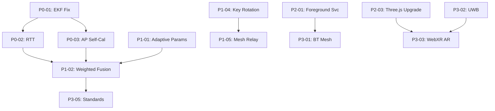

# Working_Features_Versions_History — Piece 12/13
## Article A9: A9-09 — Working Features Versions History
**Piece:** 12 of 13  
**Generated:** 2026-10-08 15:28:33 UTC

---

# Next Enhancement Roadmap: P0–P3 Priorities

## 12.1 Priority Classification

| Priority | Definition | Timeline |
|----------|------------|----------|
| **P0** | Blocks core functionality; critical bug | Immediate |
| **P1** | Major feature gap; significant UX impact | 1-2 sprints |
| **P2** | Nice-to-have; improves quality | 3-4 sprints |
| **P3** | Visionary; research/探索 | 6+ months |

---

## 12.2 P0 — Critical (Immediate)

### P0-01: EKF vy Initialization Bug ✅ FIXED v1.0.92
- **Status**: Fixed in `PositionEKF.java:38`
- **Verification**: Pre-built APK tested at `CSMWip/05_BOUNCE/BOUNCE.WIP/v92/out/`
- **Next**: Integrate fix into main branch

### P0-02: Wi-Fi RTT Ranging Implementation
- **Target**: Full 802.11mc FTM ranging → meter-level accuracy
- **Files**: `WifiRttRanging.java` (stub → full), `Trilateration.java` (RTT distances)
- **Dependencies**: API 28+, hardware support, AP firmware
- **Effort**: 3 weeks
- **Integration**: Fusion engine (WF030) weighted by RTT accuracy

### P0-03: AP Position Self-Calibration (SLAM)
- **Problem**: Trilateration needs known AP positions (currently random + gradient descent)
- **Solution**: Joint optimization of user position + AP positions
- **Approach**: Factor graph / pose graph optimization (g2o or custom)
- **Effort**: 4 weeks
- **Enables**: True indoor positioning without survey

---

## 12.3 P1 — High Priority (1-2 Sprints)

### P1-01: Adaptive Algorithm Parameters
- **Targets**: 
  - Kalman q/r (WF011) — EM online estimation
  - Particle filter path loss exponent (WF014) — per-AP learning
  - Zone HMM thresholds (WF015) — unsupervised clustering
- **Effort**: 2 weeks each (6 weeks total)
- **Impact**: Algorithms adapt to environment without tuning

### P1-02: Confidence-Weighted Multi-Algorithm Fusion
- **Current**: Equal weights (WF030)
- **Target**: Covariance intersection or CI fusion
- **Weights**: 
  - Trilateration: 1/GDOP²
  - EKF: 1/trace(P)
  - Particle: ESS/N (effective sample size)
  - HMM: zone confidence
- **Effort**: 2 weeks

### P1-04: Broadcast Encryption Key Rotation
- **Current**: Static salt for 4-slot AES key derivation (WF025)
- **Target**: Periodic key rotation via DH or pre-shared rotation schedule
- **Effort**: 1 week

### P1-05: Wi-Fi Direct Mesh Relay
- **Current**: Star topology (Group Owner + clients)
- **Target**: Multi-hop mesh (Wi-Fi Direct + Wi-Fi Aware)
- **Effort**: 3 weeks

---

## 12.4 P2 — Medium Priority (3-4 Sprints)

### P2-01: Foreground Service for BLE + GPS (Android 14+)
- **Requirement**: `FOREGROUND_SERVICE_DATA_SYNC` + `FOREGROUND_SERVICE_LOCATION`
- **Benefit**: Continuous scanning without 5s gaps; Play Store compliant
- **Effort**: 2 weeks

### P2-02: Auto-Permission Helper Library
- **Current**: Manual permission handling (WF026)
- **Target**: Reusable library with rationale dialogs, settings deep-links
- **Effort**: 1 week

### P2-03: Three.js Version Upgrade (r128 → r150+)
- **Breaking changes**: `BufferGeometry` API, `MeshStandardMaterial` params
- **Migration**: Automated codemod + manual fixes
- **Effort**: 1 week

### P2-04: HUD Responsive Design
- **Current**: Fixed 320px panel width
- **Target**: 280px mobile / 320px tablet / 400px desktop
- **Touch targets**: 48×48dp minimum
- **Effort**: 1 week

### P2-05: Trail GPX/KML Export (FP012)
- **Format**: GPX 1.1 + KML 2.2
- **Features**: Waypoints, track segments, metadata
- **Effort**: 1 week

---

## 12.5 P3 — Visionary (6+ Months)

### P3-01: Bluetooth Mesh Provisioning
- **Standard**: Bluetooth Mesh 1.0/1.1
- **Use case**: Beacon-to-beacon relay without phones
- **Effort**: 8 weeks

### P3-02: UWB Fusion (FiRa / IEEE 802.15.4z)
- **Accuracy**: <10cm ranging
- **Hardware**: UWB-enabled phones (Pixel 7+, iPhone 11+, Samsung S21+)
- **Integration**: Anchor calibration + tag tracking
- **Effort**: 12 weeks

### P3-03: WebXR AR Overlay
- **Target**: Camera passthrough + virtual beacon anchors
- **API**: WebXR Depth Sensing + Hit Test
- **Effort**: 8 weeks

### P3-04: Federated Position Learning
- **Concept**: Devices share AP position estimates (privacy-preserving)
- **Tech**: Federated averaging / differential privacy
- **Effort**: 12 weeks

### P3-05: Standards Compliance (OMA LWM2M / oneM2M)
- **Goal**: Interoperable IoT positioning
- **Effort**: 16 weeks

---

## 12.6 Enhancement Dependencies Graph

---

## 12.7 Resource Estimation Summary

| Priority | Items | Est. Weeks | Parallelizable |
|----------|-------|------------|----------------|
| P0 | 3 | 7 | P0-02 || P0-03 |
| P1 | 4 | 8 | P1-01 (3 parallel) + P1-02 |
| P2 | 5 | 6 | P2-01 || P2-02 || P2-04 |
| P3 | 5 | 44 | Sequential dependencies |
| **Total** | **17** | **~65 weeks** | **~18 months** |

---

*End of Piece 12 — Continue to Piece 13 for Summary & Cross-References*