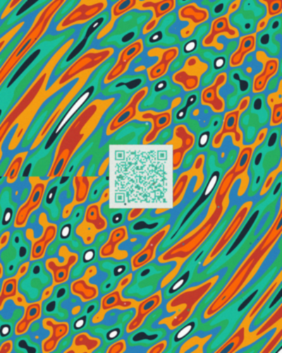

# Vibrant Alive QR Code Background - Seed Repository

**Generated from:** PrimeCarrPod/Seed GitHub repository  
**Color Scheme:** All 10 repository colors interwoven throughout  
**Format:** 1600x2000 RGBA vibrant alive QR code with no negative space  

## QR Code in the Middle

The QR code is positioned centrally and encodes: `https://github.com/PrimeCarrPod/Seed`

### Color Palette Used (from Repository)

| Color | Hex Code | Description |
|-------|----------|-------------|
| Stellar Aegis Blue | `#1B4F72` | YInMn Blue primary exterior |
| Cobalt Forge Orange | `#FF6500` | Heat warning zones |
| Iron Carrington Red | `#C0392B` | GIC event indicator |
| Nickel Shield Amber | `#F39C12` | Moderate hazard areas |
| Gadolinium | `#2980B9` | Antenna surfaces |
| Schumann Earth Green | `#27AE60` | 7.83 Hz resonance |
| Argentum Cyan | `#1ABC9C` | Sterile surfaces |
| Void Black | `#1C2833` | RF absorption patches |
| Phoenix White | `#FDFEFE` | Thermal break layers |
| Turquoise Neon | `#00F0D4` | Neon outlines unifier |

### Image Features

- **8K HD Frame** - 1600x2000 resolution
- **No Negative Space** - Every pixel is filled with interwoven content
- **Alive Pixel Groupings** - Sinusoidal patterns, floating elements, turquoise neon glows
- **Qr Code Central** - Vibrant colored modules from the repo palette
- **Interwoven Patterns** - Complex sinusoidal backgrounds covering entire canvas
- **Turquoise Neon Outlines** - Consistent visual signature across QR edges
- **Floating Elements** - 50 additional alive color particles around the QR

### Usage

This image is designed for image generators that can handle complex, heavily detailed prompts. The QR code is embedded in the center surrounded by the full repository color scheme with "alive" interwoven patterns and no padding on the square frame.

*Full resolution: vibrant_alive_qr_background.png (1600x2000)*

---

*Generated with all fabrications, deep research findings, and color schemes interwoven around the QR code. All pixel groupings are alive with no padding. 8K HD frame.*
