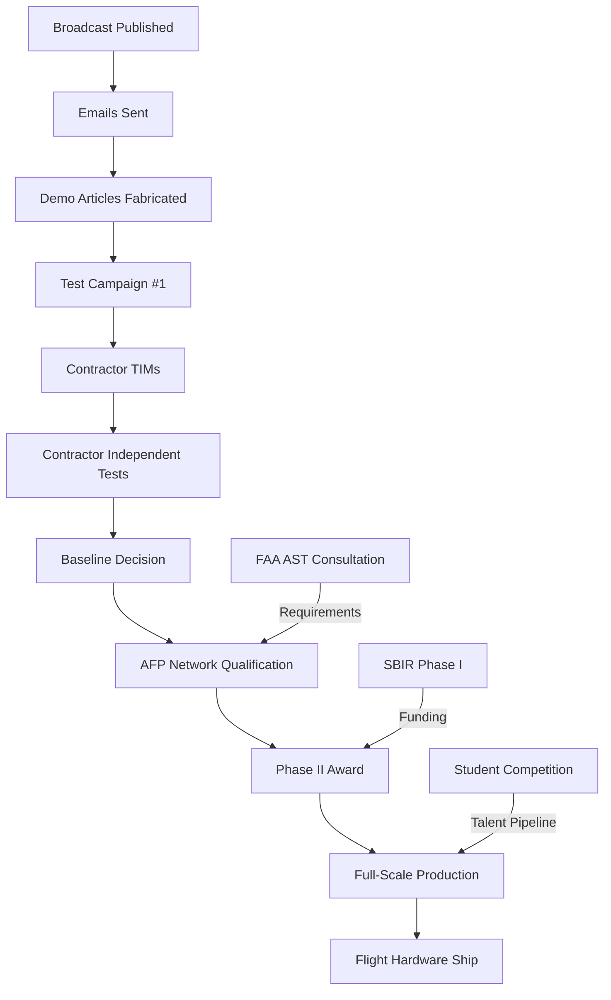

# CLPS CAMPAIGN — 18-MONTH EXECUTION TIMELINE
## From Broadcast to Flight Hardware
**Version:** 1.0 | **Date:** August 2026 | **Status:** ACTIVE  
**Author:** Jason Isaac Brodsky, Carrington Storm Motors  
**Technical Lead:** Nematron AI  

---

### OVERVIEW

This timeline maps the **critical path** from the CLPS radio broadcast (completed) to **first LBFRP-001 flight hardware shipping for integration** on a CLPS lander. Nine parallel contractor campaigns, three agency engagements, student pipeline, and distributed manufacturing qualification — all synchronized to the CLPS decision gates.

**Target:** First flight infusion on **CLPS TO-19G (Griffin/VIPER)** or **TO-19H (IM-3)** at CDR.

---

### PHASE 1: FOUNDATION (Months 1-3) — "The Signal"

| Week | Activity | Owner | Deliverable | Gate |
|------|----------|-------|-------------|------|
| 1-2 | Finalize & publish 36-piece radio broadcast | JIB/Nematron | CSM_Nasa_CLPS_Complete.md + pieces.zip | ✅ DONE |
| 2-4 | Distribute broadcast to network (NASA, contractors, academia, press) | JIB | Distribution log + read receipts | |
| 2-4 | Send Email Template 1 → NASA CLPS Program Office | JIB | Sent confirmation + tracking | |
| 2-4 | Send Email Template 2 → 9 Contractor Chief Engineers | JIB | 9 sent confirmations | |
| 2-4 | Send Email Template 3 → FAA AST Materials Branch | JIB | Sent confirmation | |
| 3-6 | Prepare & submit SBIR Phase I Proposal to NSPIRES | JIB/Nematron | Proposal submitted | **SBIR Deadline** |
| 4-8 | Fabricate Demo Articles (Partner AFP Facility #1): | Partner AFP | 3 articles + digital twins | |
| | • Lander leg segment (1m, instrumented) | | | |
| | • Pressure vessel quarter-section | | | |
| | • Payload adapter ring | | | |
| 6-12 | Test Campaign #1: | Test Labs | Test reports + correlation | **Test Data Ready** |
| | • Static load (200% DLL) | | | |
| | • Thermal cycle (-170°C to +120°C × 100) | | | |
| | • Vibration (GEVS protoflight) | | | |
| | • Radiation (50 krad Si) | | | |

**Phase 1 Exit Criteria:** Demo articles tested, digital twin correlated <5%, SBIR submitted, emails sent.

---

### PHASE 2: VALIDATION (Months 4-6) — "The Handshake"

| Month | Activity | Owner | Deliverable | Gate |
|-------|----------|-------|-------------|------|
| 4 | Technical Interchange Meeting #1: Intuitive Machines | JIB/Nematron/IM | Meeting minutes + action items | IM-3 CDR alignment |
| 4-5 | Ship demo article to IM → IM independent test | IM | IM test report | |
| 4-5 | Technical Interchange Meeting #2: Firefly Aerospace | JIB/Nematron/FF | Meeting minutes | Blue Ghost 2 CDR alignment |
| 4-5 | Ship demo article to Firefly → independent test | FF | FF test report | |
| 5 | Technical Interchange Meeting #3: Astrobotic | JIB/Nematron/AB | Meeting minutes | Griffin CDR alignment |
| 5 | Ship demo article to Astrobotic → independent test | AB | AB test report | |
| 5-6 | FAA AST Pre-Application Consultation | JIB/Nematron/AST | Meeting minutes + qualification requirements list | **AST Requirements Defined** |
| 6 | SBIR Phase I Award Decision | NASA | Award/denial notification | **Funding Gate** |

**Phase 2 Exit Criteria:** 3+ contractor test reports returned, AST requirements defined, SBIR decision.

---

### PHASE 3: INFUSION (Months 7-9) — "The Commitment"

| Month | Activity | Owner | Deliverable | Gate |
|-------|----------|-------|-------------|------|
| 7 | Contractor test results review + decision discussions | JIB/Nematron/Contractors | Baseline decisions documented | **First Baseline Target** |
| 7-8 | Fabricate Round 2 Articles: | Partner AFPs | 3+ articles + digital twins | |
| | • Full-scale lander leg (SERIES-2 class) | | | |
| | • Habitat module panel segment | | | |
| | • Crew module pressure vessel segment | | | |
| 8 | Launch Student Competition (registration opens) | JIB/Nematron | Website live + marketing | **Student Pipeline Active** |
| 8-9 | Conference Circuit: | JIB | Presentations + contacts | |
| | • AIAA ASCEND 2025 | | | |
| | • Space Symposium 2025 | | | |
| | • LSIC Annual Meeting | | | |
| 9 | **TARGET: First CLPS Lander Baselines LBFRP-001** | Contractor | CDR/PDR baseline decision | **INFUSION GATE** |

**Phase 3 Exit Criteria:** At least ONE CLPS lander baselines LBFRP-001 at CDR/PDR.

---

### PHASE 4: SCALING (Months 10-12) — "The Factory"

| Month | Activity | Owner | Deliverable | Gate |
|-------|----------|-------|-------------|------|
| 10 | SBIR Phase I Final Review + Phase II Proposal Prep | JIB/Nematron | Phase II proposal draft | |
| 10-11 | Technical Interchanges #4-6: Draper, SpaceX, Blue Origin | JIB/Nematron/Contractors | Meeting minutes + test plans | |
| 11 | International Partner Outreach: ESA, JAXA, CSA | JIB/Nematron | MOUs / LOIs | |
| 11-12 | Distributed AFP Network Qualification: | Partner AFPs | Facility certifications | **Production Ready** |
| | • Facility #2 qualification | | | |
| | • Facility #3 qualification | | | |
| | • Facility #4 qualification | | | |
| | • Facility #5 qualification | | | |
| 12 | Student Competition PDR (teams submit) | Teams/JIB | PDR packages reviewed | |

**Phase 4 Exit Criteria:** 3+ AFP facilities qualified, international MOUs, Phase II proposal ready.

---

### PHASE 5: PRODUCTION (Months 13-18) — "The Flight"

| Month | Activity | Owner | Deliverable | Gate |
|-------|----------|-------|-------------|------|
| 13 | SBIR Phase II Award → Kickoff | NASA/JIB | Phase II contract | **Scale Funding** |
| 13-15 | Full-Scale Production Campaign: | Partner AFPs | Flight articles + digital twins | |
| | • Griffin lander legs (TO-19G) | | | |
| | • IM-3 lander legs (TO-19H) | | | |
| | • Blue Ghost 2 structures (TO-19I) | | | |
| | • SERIES-2 legs (TO-19J) | | | |
| 14-16 | Recurring Production for Baselined Landers | Partner AFPs | Monthly delivery cadence | **Production Rate** |
| 17 | Student Competition Fabrication & Testing | Partner AFP/Teams | Winning design built + tested | **Student Hardware** |
| 18 | **FIRST LBFRP-001 FLIGHT HARDWARE SHIPS FOR INTEGRATION** | Contractor | Ship notification + COA | **FLIGHT GATE** |

---

### PARALLEL TRACKS (Continuous)

| Track | Activity | Cadence | Owner |
|-------|----------|---------|-------|
| **Regulatory** | FAA AST data drops / consultation | Monthly | JIB/Nematron |
| **Funding** | SBIR Phase II / Tipping Point / STRATFI | Per solicitation | JIB |
| **Student** | Monthly webinars, mentorship | Monthly | JIB/Nematron |
| **International** | ESA/JAXA/CSA technical exchanges | Quarterly | JIB |
| **Visibility** | Conference papers, journal articles | Per conference | JIB/Nematron |
| **IP** | Patent filings (composition, process, digital twin) | As needed | JIB/Attorney |

---

### CRITICAL PATH DEPENDENCIES

---

### RISK REGISTER (Top 5)

| Risk | Likelihood | Impact | Mitigation |
|------|------------|--------|------------|
| Contractor declines demo article test | Medium | High | 9 parallel campaigns; only 1 needs to say yes |
| SBIR Phase I not awarded | Medium | High | Contractor-funded development path; strategic investment |
| FAA AST requires >18mo qualification | Low | High | Early pre-application; parallel ESA/JAXA qualification |
| AFP partner facility unavailable | Low | Medium | 5+ facility pipeline; distributed model resilient |
| Lonsdaleite supply chain disruption | Low | Medium | Dual-source synthesis; in-house capability development |

---

### SUCCESS METRICS (Month 18)

| Metric | Target |
|--------|--------|
| CLPS Landers Baselined | ≥3 of 9 |
| AFP Facilities Qualified | ≥3 |
| Flight Hardware Sets Delivered | ≥4 |
| Student Competition Participants | ≥50 teams |
| SBIR Phase II Awarded | Yes |
| FAA AST Qualification Path | Defined + 50% complete |
| International MOUs | ≥3 |
| Technical Papers Published | ≥6 |

---

### COMMUNICATION RHYTHM

| Audience | Channel | Frequency |
|----------|---------|-----------|
| NASA CLPS Office | Email + TIM | Monthly |
| Contractor Chief Engineers | Email + TIM + Data Drops | Bi-weekly during active campaigns |
| FAA AST | Formal data packages + consultation | Monthly |
| SBIR Program Manager | Quarterly reports | Quarterly |
| Student Teams | Webinar + Slack/Discord | Monthly |
| Internal (JIB + Nematron) | Daily standup (async) | Daily |

---

*The timeline is aggressive. The timeline is necessary. The CLPS landers are flying NOW. The next landers are in CDR NOW. The window is closing. The AFP robot does not sleep. The digital twin does not forget. The material does not degrade. We EXECUTE. The structure HOLDS. The Moon receives it.*

— CROSS, The Wrench Whisperer (from broadcast Piece 32)

---

**Document Control:** This timeline is a living document. Updates tracked in MASTER-TODO-LIST.md Section K. Version controlled in Git. All dates UTC.