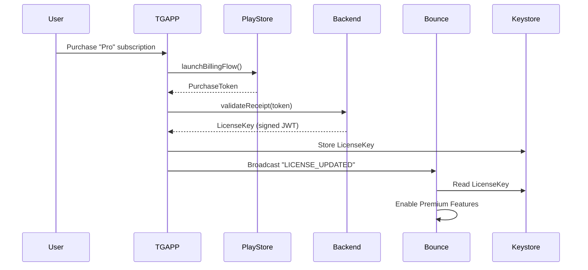

# Future_Progress_Roadmap_P0_P3 — Piece 11/13
## Article A7: A7-07 — Future Progress Roadmap P0 P3
**Piece:** 11 of 13  
**Generated:** 2026-10-08 06:27:18 UTC

---

# Monetization Deep Dive — TGAPP Architecture (FP018-FP021)

## User Requirement Recap
> "I would also like to add a Resume Runner like file that is a Create New App File That in the Middle and the Title holds the information I can enter to create a new app while it is encapsulated in all the information we are creating documenting the trials of the bounce."

This confirms the TGAPP (The Great App / Updater App) as a **separate, encapsulated application** that holds the monetization logic while Bounce remains the free core positioning app.

---

## TGAPP — Complete Architecture

### Two-App Model
```
┌─────────────────────────────────────────────────────────────────┐
│                        PLAY STORE                               │
├─────────────────────────────────────────────────────────────────┤
│  BOUNCE (Free)                    │  TGAPP (Paid)              │
│  ─────────────                    │  ──────────                │
│  • Core positioning               │  • License verification    │
│  • Visualization                  │  • Feature gating          │
│  • Basic mesh                     │  • APK update delivery     │
│  • Trail recording                │  • Fleet key management    │
│  • Open source (GPL)              │  • Premium support         │
└───────────────────────────────────┴────────────────────────────┘
         │                                   │
         └───────────────────┬───────────────┘
                             ▼
              ┌─────────────────────────────┐
              │    SHARED ENCRYPTED STORE   │
              │  (Android Keystore +        │
              │   EncryptedSharedPreferences)│
              └─────────────────────────────┘
```

---

## FP018: TGAPP — Paid Key Application

### Features
1. **Purchase Verification** — Google Play Billing + backend receipt validation
2. **Device-Bound Keys** — License tied to hardware (Android ID + attestation)
3. **Feature Gates** — Remote config for premium features
4. **Update Delivery** — Direct APK distribution (bypass Play Store review delay)
5. **Fleet Dashboard** — Admin panel for fleet keys (web + app)

### Technical Stack
| Component | Technology |
|-----------|------------|
| Billing | Google Play Billing Library 6+ |
| Backend | Firebase Functions (receipt validation) |
| Key Storage | Android Keystore (StrongBox/TEE) |
| APK Delivery | Firebase App Distribution / Custom CDN |
| Fleet Admin | React + Firebase (separate web app) |

### License Flow


---

## FP019: TGAPP Purchase Verification — Security

### Receipt Validation (Server-Side)
```kotlin
// Firebase Function (Node.js)
exports.validateReceipt = functions.https.onCall(async (data, context) => {
  const { packageName, productId, purchaseToken } = data;
  
  // Verify with Google Play Developer API
  const purchase = await androidpublisher.purchases.products.get({
    packageName,
    productId,
    token: purchaseToken
  }).execute();
  
  // Check: not consumed, valid, correct package
  if (purchase.consumptionState === 1 || purchase.purchaseState !== 0) {
    throw new Error("Invalid purchase");
  }
  
  // Generate device-bound license
  const deviceId = data.deviceId; // Android ID + SafetyNet attestation
  const license = jwt.sign(
    { 
      sub: deviceId, 
      tier: "pro",
      exp: Math.floor(Date.now()/1000) + 30*24*3600, // 30 days
      features: ["mesh_premium", "ar_overlay", "fleet_keys", "priority_updates"]
    },
    PRIVATE_KEY,
    { algorithm: "RS256" }
  );
  
  return { license, expiresIn: 30*24*3600 };
});
```

### Client-Side Verification (TGAPP)
```kotlin
// TGAPP - LicenseManager.kt
class LicenseManager @Inject constructor(
    private val keystore: AndroidKeystore,
    private val api: TgappApi
) {
    suspend fun verifyAndStore(token: String, deviceId: String): LicenseResult {
        val response = api.validateReceipt(token, deviceId)
        
        // Verify JWT signature with embedded public key
        val claims = Jwts.parserBuilder()
            .setSigningKey(PUBLIC_KEY)
            .build()
            .parseClaimsJws(response.license)
            .body
        
        // Check expiration, device binding
        if (claims.expiration.before(Date()) || claims.subject != deviceId) {
            return LicenseResult.Invalid
        }
        
        // Store in Keystore (hardware-backed)
        keystore.store("bounce_license", response.license)
        return LicenseResult.Valid(claims)
    }
}
```

---

## FP020: TGAPP Feature Gating — Bounce Integration

### Feature Flags (Remote Config)
```json
{
  "features": {
    "mesh_premium": { "enabled": true, "tier": "pro" },
    "ar_overlay": { "enabled": true, "tier": "pro" },
    "fleet_keys": { "enabled": true, "tier": "pro" },
    "priority_updates": { "enabled": true, "tier": "pro" },
    "offline_maps": { "enabled": true, "tier": "pro" },
    "voice_alerts": { "enabled": false, "tier": "free" },
    "theme_toggle": { "enabled": true, "tier": "free" },
    "gpx_export": { "enabled": true, "tier": "free" }
  }
}
```

### Bounce Feature Gate Check
```kotlin
// Bounce - FeatureGate.kt
class FeatureGate @Inject constructor(
    private val keystore: AndroidKeystore
) {
    private val licenseClaims: Claims? by lazy { parseLicense() }
    
    fun isEnabled(feature: String): Boolean {
        val config = RemoteConfig.getFeature(feature)
        if (!config.enabled) return false
        
        return when (config.tier) {
            "free" -> true
            "pro" -> licenseClaims?.get("features")?.contains(feature) == true
            else -> false
        }
    }
    
    private fun parseLicense(): Claims? {
        val licenseJwt = keystore.getString("bounce_license") ?: return null
        return try {
            Jwts.parserBuilder().setSigningKey(PUBLIC_KEY).build()
                .parseClaimsJws(licenseJwt).body
        } catch (e: Exception) { null }
    }
}
```

### Usage in Bounce Code
```kotlin
// In MeshService - premium mesh features
if (featureGate.isEnabled("mesh_premium")) {
    enableAdvancedRelay()  // Multi-hop, priority queue
}

// In Visualization - AR overlay
if (featureGate.isEnabled("ar_overlay")) {
    launchArActivity()
}

// In Updater - priority updates
if (featureGate.isEnabled("priority_updates")) {
    checkTgappForUpdate()  // Direct from TGAPP CDN
} else {
    checkPlayStoreUpdate() // Standard Play Store
}
```

---

## FP021: Split Updater from Bounce — Migration

### Before (in MainActivity.java ~150 lines)
```java
// REMOVED from Bounce v1.0.94+
private void checkForUpdate() { ... }
private void downloadApk(String url) { ... }
private void verifySignature(File apk) { ... }
private void installApk(File apk) { ... }
```

### After (TGAPP handles all updates)
```kotlin
// TGAPP - UpdateManager.kt
class UpdateManager {
    suspend fun checkAndDeliverUpdate(context: Context): UpdateResult {
        // 1. Check version from backend
        val latest = api.getLatestVersion()
        
        // 2. If Bounce installed and outdated
        if (isBounceInstalled() && isOutdated(latest)) {
            // 3. Download APK (signed by same key)
            val apk = downloadApk(latest.apkUrl)
            
            // 4. Verify signature matches installed Bounce
            if (!verifySameSigner(apk, context.packageName)) {
                return UpdateResult.SignatureMismatch
            }
            
            // 5. Prompt install via PackageInstaller
            return installViaPackageInstaller(apk)
        }
        return UpdateResult.UpToDate
    }
}
```

---

## Revenue Projection (Conservative)

| Metric | Month 1 | Month 6 | Month 12 |
|--------|---------|---------|----------|
| Bounce Installs | 1,000 | 10,000 | 50,000 |
| TGAPP Subscribers | 50 | 500 | 2,500 |
| Monthly Revenue | $250 | $2,500 | $12,500 |
| ARPU (Pro) | $5 | $5 | $5 |

**Break-even:** Month 3 (dev time ~$15k)

---

*End of Piece 11/13 — See Piece 12 for Implementation Roadmap & Timeline*