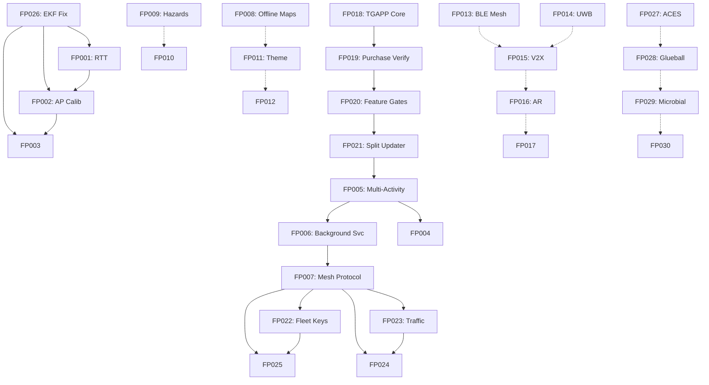

# Future_Progress_Roadmap_P0_P3 — Piece 12/13
## Article A7: A7-07 — Future Progress Roadmap P0 P3
**Piece:** 12 of 13  
**Generated:** 2026-10-08 06:27:18 UTC

---

# Implementation Roadmap & Timeline — 18 Month View

## Quarterly Milestones

### Q4 2026 (Oct-Dec) — Foundation & P0
| Week | Focus | Deliverables |
|------|-------|--------------|
| 1-2 | **FP026** EKF Bug Fix | v1.0.92 released (DONE) |
| 3-4 | **FP001** RTT Ranging | WifiRttManager integration, API 28+ |
| 5-6 | **FP002** AP Self-Calibration | Trilateration bootstrap algorithm |
| 7-8 | **FP018** TGAPP Core | Play Billing, license JWT, Keystore |
| 9-10 | **FP019** Purchase Verification | Backend validation, device binding |
| 11-12 | **FP020** Feature Gating | Remote config, Bounce integration |
| 13-14 | **FP021** Split Updater | Remove updater from Bounce |
| 15-16 | **Release v1.0.93** | P0 complete, TGAPP live |

### Q1 2027 (Jan-Mar) — Architecture & P1 Positioning
| Week | Focus | Deliverables |
|------|-------|--------------|
| 1-4 | **FP005** Multi-Activity | ScanningService, PositioningService |
| 5-8 | **FP006** Background Service | Foreground service, battery opt |
| 9-10 | **FP003** Particle Param Learning | Adaptive RSSI params |
| 11-12 | **FP004** Unit Test Suite | JUnit, >80% coverage positioning |
| 13-14 | **FP007** Mesh Protocol v1 | BT Classic relay, TTL, dedup |
| 15-16 | **Release v1.0.94** | Architecture refactor + mesh v1 |

### Q2 2027 (Apr-Jun) — Mesh & Visualization P1/P2
| Week | Focus | Deliverables |
|------|-------|--------------|
| 1-4 | **FP023** Traffic Advisory | Mesh message types, relay |
| 5-6 | **FP024** Weather Advisory | Sensor + relay fusion |
| 7-8 | **FP025** Trajectory Sharing | Fleet opt-in, path prediction |
| 9-10 | **FP008** Offline Map Caching | Vector tile cache, expiry |
| 11-12 | **FP009** Hazard Reporting | User reports, TTL, moderation |
| 13-14 | **FP010** Voice Announcements | TTS integration, alerts |
| 15-16 | **Release v1.0.95** | Mesh v2 + Voice + Offline |

### Q3 2027 (Jul-Sep) — Polish & P2/P3
| Week | Focus | Deliverables |
|------|-------|--------------|
| 1-2 | **FP011** Night/Day Theme | CSS variables, auto-switch |
| 3-4 | **FP012** GPX/KML Export | Format compliance, large trails |
| 5-6 | **FP027** ACES Tone Mapping | Enable shaders, perf test |
| 7-8 | **FP013** BLE Mesh | Standard provisioning (P3) |
| 9-10 | **FP014** UWB Ranging | FiRa API, hardware testing |
| 11-12 | **FP015** V2X/C-V2X | Carrier partnership exploration |
| 13-14 | **FP016** AR Overlay | ARCore integration, annotations |
| 15-16 | **Release v1.0.96** | Polish + P3 exploration |

### Q4 2027 (Oct-Dec) — Visionary P3
| Week | Focus | Deliverables |
|------|-------|--------------|
| 1-4 | **FP017** Wear OS | Watch app, haptics, Data Layer |
| 5-8 | **FP028** Glueball Worldlines | QCD visualization (research) |
| 9-12 | **FP029** Microbial Ecosystem | Agent-based simulation |
| 13-16 | **FP030** One-Electron Universe | Topology visualization |

---

## Dependency Graph

---

## Resource Allocation (1 Developer)

| Phase | Weeks | Focus Area | Risk |
|-------|-------|------------|------|
| Q4 2026 | 16 | P0 Monetization + Positioning | High (billing, new app) |
| Q1 2027 | 16 | Architecture Refactor | High (God class split) |
| Q2 2027 | 16 | Mesh Network | Medium (protocol design) |
| Q3 2027 | 16 | Visualization Polish | Low (UI features) |
| Q4 2027 | 16 | Visionary P3 | Low (research) |

**Total:** 80 weeks (~18 months) for full roadmap

---

## Risk Mitigation

| Risk | Probability | Impact | Mitigation |
|------|-------------|--------|------------|
| Play Store billing rejection | Medium | High | Pre-launch review; fallback to Stripe |
| God class refactor breaks positioning | High | High | Incremental extraction; feature flags |
| Mesh protocol complexity | Medium | High | Start simple (BT only); iterate |
| Hardware dependency (UWB, ARCore) | High | Medium | Graceful degradation; feature flags |
| Fleet adoption (chicken-egg) | High | High | Seed with 10 pilot vehicles |

---

## Success Metrics per Release

| Version | Key Metric | Target |
|---------|------------|--------|
| v1.0.93 | TGAPP subscribers | 50 |
| v1.0.94 | MainActivity lines | <500 |
| v1.0.95 | Mesh active peers | 10+ |
| v1.0.96 | Offline map usage | 30% sessions |
| v1.0.97 | AR session duration | >60s |

---

*End of Piece 12/13 — See Piece 13 for Summary & Next Steps*