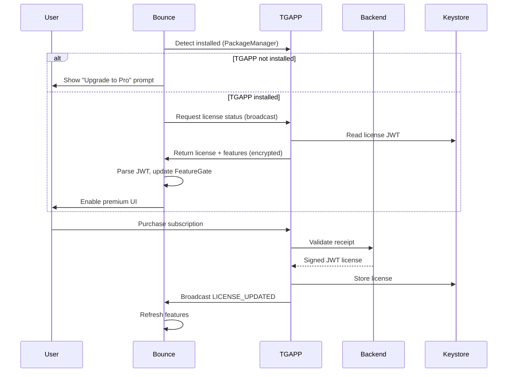

# TGAPP_Monetization_Architecture — Piece 02/13
## Article A8: A8-08 — TGAPP Monetization Architecture
**Piece:** 02 of 13  
**Generated:** 2026-10-08 06:55:00 UTC

---

# Bounce↔TGAPP Integration Layer (TG005-TG008)

## TG005: Bounce-TGAPP Detection
- **Category:** Integration | **Priority:** P0 | **Effort:** Medium | **Target:** 1.0.93
- **Description:** Bounce checks if TGAPP installed and license valid
- **Implementation:**
```kotlin
// Bounce - TGAppDetector.kt
object TGAppDetector {
    private const val TGAPP_PACKAGE = "com.carrpod.tgapp"
    private const val LICENSE_ACTION = "com.carrpod.tgapp.LICENSE_STATUS"
    
    fun isTGAppInstalled(context: Context): Boolean {
        return try {
            context.packageManager.getPackageInfo(TGAPP_PACKAGE, 0)
            true
        } catch (e: PackageManager.NameNotFoundException) {
            false
        }
    }
    
    fun requestLicenseStatus(context: Context): LicenseStatus {
        // Query TGAPP via explicit intent
        val intent = Intent(LICENSE_ACTION).setPackage(TGAPP_PACKAGE)
        // Use PackageManager.queryBroadcastReceivers to verify
        // Listen for response broadcast with license JWT
    }
}
```
- **Security:** Verify TGAPP signature matches expected cert (prevent spoofing)

## TG006: Premium Feature Unlock
- **Category:** Integration | **Priority:** P0 | **Effort:** Medium | **Target:** 1.0.93
- **Description:** Bounce enables premium features when TGAPP license valid
- **Implementation:**
```kotlin
// Bounce - FeatureGate.kt
class FeatureGate @Inject constructor(
    private val keystore: AndroidKeystore
) {
    private val licenseClaims: Claims? by lazy { parseLicense() }
    
    fun isEnabled(feature: String): Boolean {
        val config = RemoteConfig.getFeature(feature)
        if (!config.enabled) return false
        return when (config.tier) {
            "free" -> true
            "pro" -> licenseClaims?.get("features")?.contains(feature) == true
            else -> false
        }
    }
    
    private fun parseLicense(): Claims? {
        val licenseJwt = keystore.getString("bounce_license") ?: return null
        return try {
            Jwts.parserBuilder().setSigningKey(TGAPP_PUBLIC_KEY).build()
                .parseClaimsJws(licenseJwt).body
        } catch (e: Exception) { null }
    }
}
```
- **Storage:** EncryptedSharedPreferences (AES-256, Keystore-backed)

## TG007: Update Delivery via TGAPP
- **Category:** Integration | **Priority:** P0 | **Effort:** High | **Target:** 1.0.93
- **Description:** TGAPP downloads and installs Bounce updates (bypasses Play Store review)
- **Flow:**
```
1. TGAPP checks backend for latest Bounce version
2. If newer than installed: download APK (HTTPS, signature verified)
3. Verify APK signed with SAME KEY as installed Bounce (critical!)
4. Install via PackageInstaller API (requires user confirmation)
5. Notify Bounce of update via broadcast
```
- **Critical Security:** TG022 - Signature verification prevents supply chain attacks

## TG008: Feature List Sync
- **Category:** Integration | **Priority:** P0 | **Effort:** Medium | **Target:** 1.0.93
- **Description:** TGAPP communicates which features are unlocked for this license
- **Mechanism:** Intent extras with encrypted payload (AES-256, key from Keystore)
- **Payload:**
```json
{
  "license_id": "license_abc123",
  "expires": 1700000000,
  "features": ["mesh_premium", "ar_overlay", "fleet_keys", "priority_updates", "offline_maps"],
  "tier": "pro",
  "fleet_id": "fleet_xyz"  // if applicable
}
```

---

## Integration Sequence Diagram



---

*End of Piece 02/13 — See Piece 03 for Premium Features (Mesh, Traffic, Weather)*