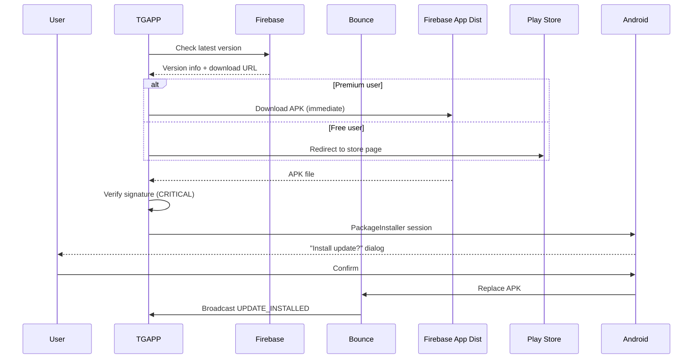

# TGAPP_Monetization_Architecture — Piece 10/13
## Article A8: A8-08 — TGAPP Monetization Architecture
**Piece:** 10 of 13  
**Generated:** 2026-10-08 06:55:00 UTC

---

# Distribution — Direct APK Download & Delta Updates (TG028-TG029)

## TG028: Direct APK Download
- **Category:** Distribution | **Priority:** P0 | **Effort:** High | **Target:** 1.0.93
- **Description:** TGAPP hosts Bounce APKs for direct download (bypass Play Store)
- **Why:** Rapid iteration (hours vs days); fleet needs immediate updates; beta testing

### Hosting Options

| Option | Pros | Cons | Decision |
|--------|------|------|----------|
| **Firebase App Distribution** | Free, access groups, release notes, tester management | 100 testers limit (free) | ✅ **Primary** |
| **GitHub Releases** | Free, unlimited, version history | No access control, manual | ✅ **Backup** |
| **Custom CDN (Cloudflare R2)** | Full control, cheap ($0.015/GB) | Self-managed auth | Future |
| **Play Store Internal Testing** | Official, seamless install | 2-24h review, 100 testers | Fallback |

### Implementation: Firebase App Distribution
```kotlin
// TGAPP - UpdateManager.kt
class UpdateManager @Inject constructor(
    private val api: TgappApi,
    private val context: Context
) {
    private const val BOUNCE_PACKAGE = "com.carrpod.bounce"
    private const val FIREBASE_APP_ID = "1:123456789:android:abcdef"
    
    suspend fun checkAndDeliverUpdate(): UpdateResult {
        // 1. Get latest version from backend
        val latest = api.getLatestBounceVersion()
        
        // 2. Check if Bounce installed and outdated
        val installed = getInstalledBounceVersion()
        if (installed == null) return UpdateResult.BOUNCE_NOT_INSTALLED
        if (latest.versionCode <= installed.versionCode) return UpdateResult.UP_TO_DATE
        
        // 3. Check if user has premium (priority updates)
        val hasPriority = FeatureGate.isEnabled("priority_updates")
        val downloadUrl = if (hasPriority) {
            latest.firebaseDistributionUrl  // Immediate access
        } else {
            latest.playStoreUrl  // Free users wait for Play Store
        }
        
        // 4. Download APK (with progress notification)
        val apkFile = downloadApk(downloadUrl, latest.versionName)
        
        // 5. CRITICAL: Verify signature matches installed Bounce
        if (!SignatureVerifier.verifyApkSignature(apkFile.absolutePath, context)) {
            apkFile.delete()
            return UpdateResult.SIGNATURE_MISMATCH
        }
        
        // 6. Install via PackageInstaller (requires user confirmation)
        return installViaPackageInstaller(apkFile)
    }
    
    private fun downloadApk(url: String, version: String): File {
        val destination = File(context.cacheDir, "bounce_$version.apk")
        
        val request = DownloadManager.Request(Uri.parse(url))
            .setTitle("Bounce v$version")
            .setDescription("Downloading update...")
            .setDestinationUri(Uri.fromFile(destination))
            .setNotificationVisibility(DownloadManager.Request.VISIBILITY_VISIBLE_NOTIFY_COMPLETED)
            .setAllowedNetworkTypes(DownloadManager.Request.NETWORK_WIFI or DownloadManager.Request.NETWORK_MOBILE)
        
        val downloadId = context.getSystemService(DownloadManager::class.java).enqueue(request)
        
        // Wait for completion (with timeout)
        return awaitDownload(downloadId, destination)
    }
    
    private fun installViaPackageInstaller(apkFile: File): UpdateResult {
        val installer = context.packageManager.packageInstaller
        val sessionParams = PackageInstaller.SessionParams(
            PackageInstaller.SessionParams.MODE_FULL_INSTALL
        ).apply {
            setAppPackageName(BOUNCE_PACKAGE)
        }
        
        val sessionId = installer.createSession(sessionParams)
        val session = installer.openSession(sessionId)
        
        try {
            val outputStream = session.openWrite("base.apk", 0, -1)
            apkFile.inputStream().copyTo(outputStream)
            outputStream.close()
            
            session.fsync(outputStream)
            
            // Commit session (shows system install dialog)
            val intent = Intent(context, UpdateReceiver::class.java)
            intent.action = "com.carrpod.tgapp.UPDATE_COMPLETE"
            val pendingIntent = PendingIntent.getBroadcast(
                context, 0, intent, PendingIntent.FLAG_IMMUTABLE
            )
            session.commit(pendingIntent.intentSender)
            
            return UpdateResult.INSTALL_PENDING
        } catch (e: Exception) {
            installer.abandonSession(sessionId)
            return UpdateResult.INSTALL_FAILED
        }
    }
}
```

### Update Flow Diagram


## TG029: Delta Updates (Future, Backlog)
- **Category:** Distribution | **Priority:** P2 | **Effort:** High | **Target:** 1.0.95+
- **Description:** Binary patches for smaller downloads (bsdiff)
- **Tech:** `bsdiff` / `bspatch` (Google's Chrome uses this)
- **Savings:** ~80-90% smaller (45MB → 5MB typical)

### Implementation Approach
```kotlin
// Future: DeltaUpdateManager.kt
class DeltaUpdateManager {
    // 1. Server generates patch: bsdiff(old.apk, new.apk) -> patch.file
    // 2. Client downloads patch (small)
    // 3. Client applies: bspatch(old.apk, new.apk, patch.file)
    // 4. Verify new.apk signature
    // 5. Install
    
    // Requires: 
    // - Known old version (client reports current version)
    // - Server stores patches for each version pair
    // - Native bspatch library (C++ via JNI)
}
```

### Storage Requirements
| Version Range | Full APK | Delta Patch | Savings |
|---------------|----------|-------------|---------|
| 1.0.94 → 1.0.95 | 45 MB | ~4 MB | 91% |
| 1.0.90 → 1.0.95 | 45 MB | ~12 MB | 73% |
| 1.0.0 → 1.0.95 | 45 MB | ~35 MB | 22% |

**Strategy:** Generate deltas from last 3 versions; older = full download.

---

*End of Piece 10/13 — See Piece 11 for Business: Free Tier, Fleet Pricing, Referral*