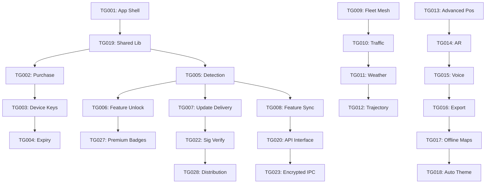

# TGAPP_Monetization_Architecture — Piece 12/13
## Article A8: A8-08 — TGAPP Monetization Architecture
**Piece:** 12 of 13  
**Generated:** 2026-10-08 06:55:00 UTC

---

# Implementation Roadmap & Technical Debt

## 18-Week Implementation Plan

### Phase 1: Core TGAPP (Weeks 1-6) — P0 Items
| Week | Focus | Deliverables |
|------|-------|--------------|
| 1-2 | **TG001** App Shell + **TG019** Shared Library | New module `tgapp`, `bounce-common` AAR |
| 3-4 | **TG002** Purchase Verification + **TG003** Device Keys | Play Billing, Firebase Functions, Keystore |
| 5 | **TG004** Key Expiry + **TG021** ProGuard/R8 | Subscription renewal, obfuscation |
| 6 | **TG026** TGAPP Home Screen | Compose UI, license display, feature grid |

### Phase 2: Bounce Integration (Weeks 7-10) — P0 Items
| Week | Focus | Deliverables |
|------|-------|--------------|
| 7 | **TG005** Detection + **TG006** Feature Unlock | PackageManager query, FeatureGate |
| 8 | **TG007** Update Delivery + **TG022** Sig Verify | Firebase App Dist, signature check |
| 9 | **TG008** Feature Sync + **TG020** API Interface | Encrypted intent, AIDL contract |
| 10 | **TG023** Encrypted IPC + **TG027** Premium Badges | AES-GCM session, UI badges |

### Phase 3: Premium Features (Weeks 11-14) — P1 Items
| Week | Focus | Deliverables |
|------|-------|--------------|
| 11 | **TG009** Fleet Mesh + **TG010** Traffic Relay | Mesh protocol v2, fleet keys |
| 12 | **TG011** Weather Relay + **TG012** Trajectory | Message types, BT 3D integration |
| 13 | **TG013** Advanced Positioning | RTT/UWB/Particle learning gates |
| 14 | **TG014** AR Overlay + **TG015** Voice | ARCore, TTS integration |

### Phase 4: Polish & Launch (Weeks 15-18) — P2 Items
| Week | Focus | Deliverables |
|------|-------|--------------|
| 15 | **TG016** GPX/KML + **TG017** Offline Maps | Export, Mapbox offline |
| 16 | **TG018** Auto Theme + **TG024** License Server | CSS vars, Functions |
| 17 | **TG025** Analytics + **TG028** Distribution | Opt-in telemetry, Firebase |
| 18 | **TG030** Free Tier + **TG031** Fleet Pricing | Play Store listing, billing |

---

## Technical Debt from Forensic Analysis

### Bounce MainActivity (1,416 lines) — Must Refactor Before TGAPP Integration
```
Current coupling prevents clean IPC:
- Updater code mixed with positioning
- No service boundaries
- Direct WebView manipulation everywhere
- SharedPreferences used for everything
```

### Required Refactors (Parallel to TGAPP)
| Refactor | Effort | Blocks |
|----------|--------|--------|
| Extract ScanningService | High | TG005 (clean IPC) |
| Extract PositioningService | High | TG013 (premium algos) |
| Extract MeshService | Medium | TG009 (fleet mesh) |
| Extract Updater → TGAPP | Medium | TG007 (clean split) |
| Introduce bounce-common | Low | All integration |

### Dependency Graph


---

## Risk Register

| Risk | Probability | Impact | Mitigation |
|------|-------------|--------|------------|
| Play Store rejects "APK installer" | Medium | High | Use Firebase App Distribution (policy compliant) |
| MainActivity refactor breaks positioning | High | High | Incremental extraction; feature flags; comprehensive tests |
| Signature verification fails on some devices | Low | Critical | Test on 10+ devices; fallback to Play Store |
| Fleet key provisioning UX too complex | Medium | Medium | QR + NFC; admin dashboard; docs |
| Free tier too generous → low conversion | Medium | Medium | A/B test feature gates; monitor metrics |
| ARCore device fragmentation | High | Low | Graceful degradation; feature flag |
| UWB hardware rare | High | Low | RTT fallback; feature flag |

---

*End of Piece 12/13 — See Piece 13 for Summary & Next Steps*